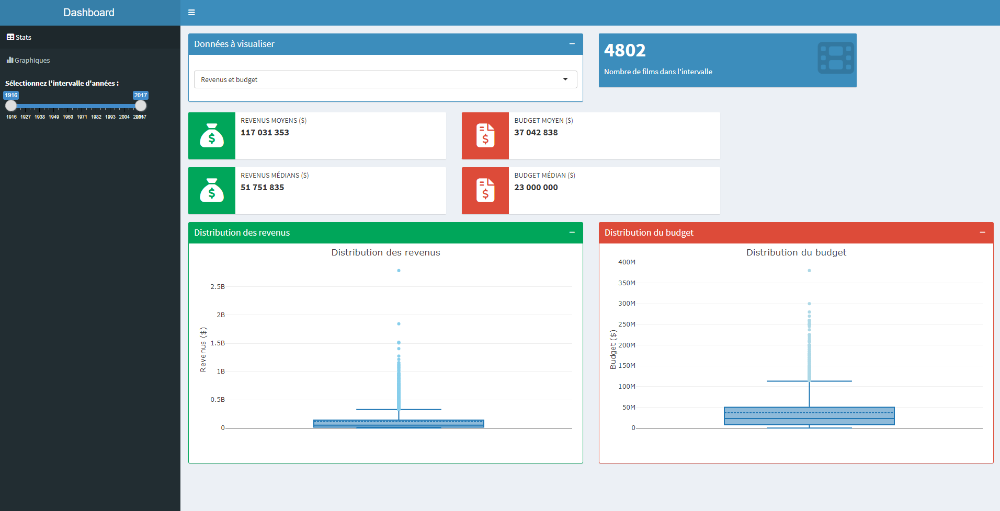
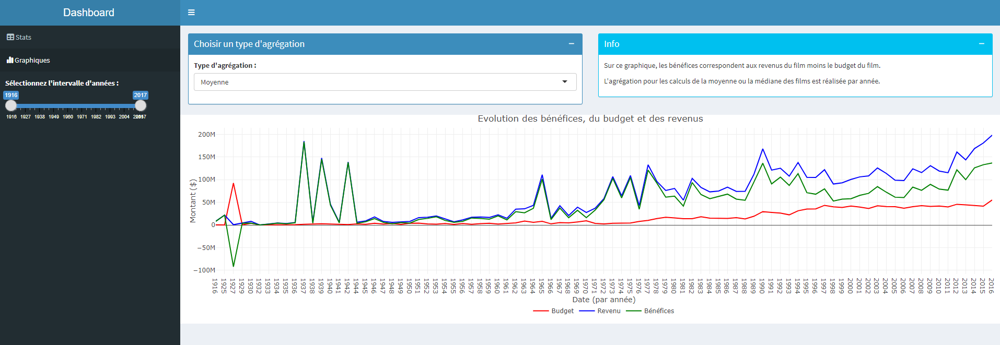

```{r setup, include=FALSE}
knitr::opts_chunk$set(echo = FALSE, warning = FALSE, message = FALSE)
```

```{r library}
library(ggplot2)
library(tibble)
library(tidyr)
library(lubridate)
library(dplyr)
library(readr)
library(forcats)
library(prettydoc)
library(stringr)
library(tidyverse)
library(plotly)
library(kableExtra)
library(scales)
library(leaflet)
library(countrycode)
library(htmltools)
library(viridis)
library(RColorBrewer)
library(tm)
library(wordcloud)
```

```{r data}
data <- read_csv("data/movies.csv")
```


# Introduction

🎥 Bienvenue dans le projet d'exploration cinématographique ! 🎥

Une étude basée sur la visualisation de données 📈 pour découvrir le dessous des films à succès ⭐

L'équipe 🚀 

- Eloïse LAPLANCHE 

- Laure PENG 

- Gaudeline Maeva SIMO KAMWA 

- Belvine YEMDJO YOUMBI

## Données

Nous avons choisi d’étudier un dataset regroupant des données sur les films à succès. Ce jeu de données a été trouvé sur Kaggle et a été modifié par nos soins pour garder uniquement les features qui nous importent dans cette étude. 

Le choix de travailler sur des données liées au monde du cinéma résulte de l’envie de la part des membres de notre équipe de découvrir plus en détail cet univers. Toutes les quatre amatrices de films, ce jeu de données sera pour nous l’occasion de travailler sur un sujet qui nous intéresse et qui nous intrigue.


- Nombre d’observations : 4803

- Nombre de variables : 17

- Source : https://www.kaggle.com/datasets/harshshinde8/movies-csv

- Auteur : Harsh Shinde [🔗](https://www.linkedin.com/in/harshshinde/)

Détail des données : 

| Variable                | Type     | Description                                |
|-------------------------|----------|--------------------------------------------|
| budget                  | `Int`    | Budget global pour réaliser le film        |
| genres                  | `String` | Genres associés au film                    |
| keywords                | `String` | Mots-clés représentant le film             |
| overview                | `String` | Synopsis du film                           |
| popularity              | `Float`  | Popularité du film (entre 0 et 876)        |
| production_companies    | `String` | Liste des sociétés de productions          |
| production_countries    | `String` | Liste des pays de production               |
| release_date            | `Date`   | Date de sortie du film                     |
| revenue                 | `Int`    | Revenus générés par le film                |
| runtime                 | `Float`  | Durée du film (en minutes)                 |
| spoken_languages        | `String` | Liste des langues parlées dans le film     |
| tagline                 | `String` | “Slogan” du film                           |
| title                   | `String` | Titre du film                              |
| vote_average            | `Float`  | Moyenne de la note attribuée (entre 0 et 10)|
| vote_count              | `Int`    | Décompte du nombre de votes (entre 0 et 13752)|
| cast                    | `String` | Liste des noms des acteurs du film         |
| director                | `String` | Nom du réalisateur du film                 |


On peut relever dans ce dataset plusieurs grands groupes de données : 

- Les données de **description du film** (*genres, keywords, overview, tagline, title*)

- Les données concernant la **réalisation du film** (*director, cast, spoken_languages, runtime, release_date, production_countries, production_companies, budget*)

- Les données sur les **retombées du film** (*popularity, revenue, vote_average, vote_count*)

## Plan d'analyse

Ce dataset étant assez riche, nous pouvons élaborer un plan d’analyse selon plusieurs grands axes d’étude :

### Analyse du succès des films

Dans cette partie, on s’interrogera sur les facteurs qui pourraient ressortir lorsqu’un film a du succès. Pour cela, on peut se baser sur nos indicateurs de popularité et de note moyenne et les comparer avec d’autres features comme le genre du film, le réalisateur ou le budget. Dans cette partie, il faudra veiller à bien mettre en regard la note du film avec le nombre de votants, afin de ne pas avoir d'analyse biaisée par un nombre de votants trop faible sur un film par exemple.

***Attentes :*** On peut supposer que plus le réalisateur est connu ou que plus le budget est important, et plus le film sera populaire et obtiendra une bonne note. Nous pensons également que les films d'actions seront sans doute les films avec le plus de succès.

***Exemples de questions :***

**Succès du film :** 

- Quels sont les réalisateurs les plus populaires en fonction du genre (ou en fonction du nombre de films réalisés) ?

- Quel genre de film génère le plus de revenus ?

- Quels sont les genres les plus populaires ?

- Est-ce qu'il y a un lien entre les acteurs et la popularité ou la note du film ?
  
**Appréciation du film :**

- Est-ce qu’il y a un lien entre le budget et la note ?

- Est-ce qu'il y a un lien entre la réalisation de plusieurs films du même genre et la note du film ?

- Est ce que la langue originale du film a une influence ?

- Y-a-t-il un lien entre popularité et note du film ?


###  Analyse des tendances temporelles
Nous pourrons ici analyser plusieurs features en regard des dates de sortie du film. On pourra ou non constater des évolutions de genre, de réalisateurs ou encore de sociétés de production en fonction du temps afin de voir si de nouveaux schémas se dessinent. Nos données vont de 1916 à 2017, mais nous possédons un nombre de films supérieur à 100 qu'à partir de 1993, il faudra donc faire attention lors de l'analyse.

***Attentes :*** On peut supposer que les grosses sociétés de production perdurent au fil du temps et qu'au contraire, les petites sociétés laissent place à d'autres. On pourra aussi vérifier s'il existe des pays "à la mode" sur certaines années. On s'attend également à une évolution du budget des sociétés dans le temps.

***Exemples de questions :***

- Quels sont les pays qui ont réalisé le plus de films en fonction des années ?

- Est-ce qu’il y a une évolution de la popularité des films dans le temps ?

- Est-ce que l'année de réalisation impacte sur le genre du film ?

- Est-ce que le budget a évolué au fil des années ?

- Est-ce qu’il y a une évolution de la durée des films dans le temps ?

- Est-ce qu'il y a un lien entre le budget d'un film et sa durée ?

- Est-ce qu'il y a une différence de durée des films dans chaque pays ?

- Est-ce que les maisons de production ont varié le genre de leurs films au fil du temps ?

### Analyse des mots employés pour décrire le film
Ici, on pourrait analyser les features telles que le slogan, le titre, le synopsis et les mots-clés pour trouver des liens et faire ressortir des patterns. On pourra aussi évaluer si le choix de ces mots a une influence sur l'appréciation ou la note du film. Le traitement de données textuelles peut être certaines fois délicat, il faudra donc veiller à ce que les techniques de traitement soient appropriées et les biais identifiés.

***Attentes :*** On pense trouver des mots-clés qui ressortent selon le genre du film. On peut aussi imaginer que selon la compagnie de production ou le réalisateur, des mots-clés peuvent être repris dans les films qu'ils produisent, comme une marque de fabrique.

***Exemples de questions :***

- Est-ce qu’il y a des mots que l’on retrouve le plus dans le titre selon le genre du film ?

- Quels sont les mots-clés les plus fréquents en fonction du genre ?

- Est-ce que certains mots-clés ressortent dans les films de telle ou telle compagnie de production ou pour tel réalisateur ? Cela a-t-il un lien avec le pays de production ?

- Est-ce que les mots-clés utilisés ont une influence sur l'appréciation ou la note du film ?


# Exploration


### Appréciation du film

Nous allons nous interroger dans un premier temps sur le lien que l'on peut avoir entre la note attribuée par les utilisateurs au film et sa popularité.
Dans le dataset récupéré, il n'est pas explicité clairement à quoi correspond la popularité du film. Nous prenons donc le parti de dire que la popularité correspond au volume d'activité lié au film, c'est à dire si les personnes le regardent, peu importe qu'elles l'apprécient ou non.

On s'attend à ce que plus un film est populaire, et plus sa note moyenne est élevée. 

Tout d'abord, on effectue une rapide analyse de nos données présentes pour ces deux features. Comme il s'agit de variables quantitatives continues, on les présente à travers un histogramme.

```{r analyse note}
ggplot(data = data, mapping = aes(x = vote_average)) +
  geom_histogram(bins = 30, fill = "#69b3a2") +
  labs(title = "Répartition des notes moyennes attribuées aux films",
       x = "Note moyenne obtenue",
       y = "Nombre d'occurrences") 
```

Nous constatons que les données semblent cohérentes, exceptées celles qui ont une note moyenne de 0. En effet, il est difficilement concevable de penser qu'un film jugé par plusieurs personnes se voit attribuer la note moyenne de 0. On peut imaginer qu'il s'agissait de valeurs manquantes mises à 0 dans le dataset.
Nous prendrons donc le parti, pour la question du lien entre popularité et note, de retirer les lignes qui ont une note de 0. On utilise une technique d'extraction sous conditions pour faire cela.

```{r analyse popularité}
data_filtered_1 <- subset(data, popularity < 150)

ggplot(data = data_filtered_1, mapping = aes(x = popularity)) +
  geom_histogram(bins = 30, fill = "#69b3a2") +
  labs(title = "Répartition de la popularité attribuée aux films",
       x = "Popularité attribuée",
       y = "Nombre d'occurrences")
```


Ici la popularité a été filtrée avec la même technique que pour la note, pour ne sélectionner que les films avec un popularité inférieure à 150. En effet, seules 19 valeurs sont au dessus de cette limite que nous nous fixons. La popularité moyenne est de `r round(mean(data$popularity[data$popularity < 150]), 1)`.


Pour obtenir un graphique lisible par la suite, nous allons calculer la popularité moyenne en fonction de la note moyenne. Pour cela, nous commençons par créer des intervalles de note de 0.5 en 0.5, puis nous dispachons nos données dans les intervalles correspondant avant de faire la moyenne de la popularité pour chaque intervalle. La popularité moyenne est donc une variable quantitative continue, et après modification, la note moyenne devient une variable qualitative ordonnée.

Comme on souhaite comparer ces deux éléments, on réalisera un diagramme en barres. Nous ajustons la largeur des barres pour que le graphique soit plus agréable à lire.

```{r comparaison_note_popularite}

intervalles <- seq(0, 10, by = 0.5)

data_grouped <- data %>%
  filter(popularity < 150, vote_average != 0) %>%
  group_by(vote_intervalle = cut(vote_average, breaks = intervalles, right = FALSE)) %>%
  summarize(mean_popularity = mean(popularity))

ggplot(data = data_grouped, aes(x = vote_intervalle, y = mean_popularity)) +
  geom_bar(stat = "identity", fill = "skyblue", width = 0.8) +
   scale_x_discrete(labels = paste0(intervalles, " - ", intervalles + 0.5)) +
  theme(axis.text.x = element_text(angle = 45, hjust = 1))+
  labs(x = "Note moyenne", y = "Popularité moyenne", 
       title = "Popularité moyenne par tranche de note de 0.5")
```

**Analyse**

Les résultats obtenus sont conformes avec ce que l'on attendait. En effet, on constate que plus la note est élevée, et plus la popularité augmente. 

En revanche, on voit que pour les notes très élevées (8,5+), la popularité est proche de 0, ce qui ne semble pas normal de prime abord. Cependant, si l'on recoupe ce graphique avec celui montrant la distribution des notes, on constate que très peu de réponses sont enregistrées pour les intervalles de 0 à 2,5 et 8,5 à 10. Ceci explique que la popularité moyenne attribuée soit aussi basse. Pour résoudre ce problème, il faudrait pouvoir collecter plus de données sur les films qui obtiennent une excellente note (ce qui est par ailleurs rare).


---


Maintenant que nous avons montré le lien entre la note et la popularité du film, nous allons nous pencher sur l'étude de la distribution du budget par tranches de notes. Il est intéressant d'essayer de comprendre ce qui peut jouer dans la note qu'attribue un utilisateur à un film.

Nous nous attendons plutôt à ce qu'un film avec un budget important obtienne une bonne note, même si l'on sait que des films à faible budget sont aussi capables d'avoir de bonnes notes et inversement.

Commençons par analyser le budget, qui est une variable quantitative continue, à l'aide d'un histogramme.

```{r analyse budget}
ggplot(data = data, mapping = aes(x = budget)) +
  geom_histogram(bins = 60, fill = "#69b3a2") +
  scale_x_continuous(labels = function(x) sprintf("%.0f M", x / 1e6)) +
  labs(title = "Répartition du budget attribué aux films",
       x = "Budget attribué (en M de $)",
       y = "Nombre d'occurrences")
```

On constate que plus de 1500 films ont un budget de 0, ce qui n'est pas concevable. Nous allons donc exclure ces données enregistrées à 0 par extraction conditionnelle pour la suite de l'analyse, afin de ne pas fausser les résultats. En effet, un film coûte forcément de l'argent pour être réalisé. 

Nous avons à disposition le budget qui est une variable quantitative continue, et la note que l'on laisse sous la forme de variable qualitative ordonnée.

Puisque l'on souhaite faire une distribution, on utilise un boxplot (la moyenne, à titre indicatif, est représentée par un point bleu). 

Avant de créer ce boxplot, plusieurs prétraitements sont nécessaires. Outre l'extraction conditionnelle, nous devons aussi créer des intervalles de notes de 1 à 10 par pas de 1 pour que nous graphique soit plus lisible. Nous répartissons ensuite ces données dans ces tranches avant d'effectuer la distribution.

Pour plus de lisibilité, le diagramme suivant est interactif afin de pourvoir zoomer sur certaines parties, et obtenir les valeurs correspondantes. 

```{r comparaison_note_budget}

data_filtered <- data[data$budget != 0 & data$vote_average != 0, ]
intervalles <- seq(0, 10, by = 1)
plot_interactif_1 <- ggplot(data = data_filtered, aes(x = cut(vote_average, breaks = intervalles), y = budget)) +
    geom_boxplot(fill = "skyblue", color = "black", size = 0.3) +  
    stat_summary(fun = "mean", geom = "point", shape = 20, size = 2, color = "darkblue") +
    labs(x = "Note obtenue", y = "Budget du film (en M de $)", title = "Distribution du budget des films en fonction de la note obtenue par tranche de 1") +
    scale_y_continuous(labels = function(x) sprintf("%.1f M", x / 1e6)) +
    theme(axis.text.x = element_text(angle = 45, hjust = 1))
plotly_plot <- ggplotly(plot_interactif_1, tooltip = c())
plotly_plot

```

**Analyse**

On constate que finalement, ce ne sont pas forcément les films avec le plus gros budget qui obtiennent la meilleure note. 

Les budgets médians les plus élevés sont pour les notes comprises entre 5 et 7, ce qui signifie qu'il n'existe pas de relation claire entre le budget d'un film et sa note. Un budget plus faible, comme c'est le cas pour la médiane des notes de 2 à 5 et de 7 à 9, peut donner un très bon film comme un mauvais film aux yeux des spectateurs. 

Ici, les outliers sont intéressants puisque l'on constate que plusieurs très gros budgets mènent à une note correcte voire très bonne.On en recense pas d'outliers qui aurait un budget très important et une note très basse, ce qui pourrait vouloir dire qu'u budget élevé garantirait en quelques sortes une note acceptable. 

La moyenne est en accord avec les résultats évoqués après analyse de la médiane, à savoir que les films avec une note bonne mais pas excellente, on en moyenne le budget le plus élevé.

Les données des notes 1,2 et 9,10 sont à relativiser puisque très peu d'observations sont faites sur ces intervalles. 

On comprend avec cette visualisation que le budget seul ne peut pas expliquer une bonne ou mauvaise note, que d'autres facteurs entrent certainement en jeu. Cependant, lorsqu'un film est en préparation, il faut réfléchir à sa rentabilité, à l'équilibre financier. Même si une bonne note pourrait inciter les personnes à acheter ou aller voir le film, il est envisageable d'aller au cinéma pour voir un film avec beaucoup d'actions ou un gros casting, même si la note n'est pas exceptionnelle par exemple. Dans ce cas, il faudrait nous intéresser plutôt à la popularité du film qu'à sa note.

---

Maintenant que nous avons analysé la distribution du budget en fonction de la note, nous allons essayer de comparer le budget et la popularité. 

En effet, nous pensons qu'un film avec un gros budget peut être populaire dans l'esprit collectif. Lorsque l'on voit qu'un film s'est vu attribuer un budget conséquent, on peut espérer un beau casting, des décors travaillés ou encore une animation attractive, et donc être amenés à vouloir visionner ce film. 

On s'attend donc à ce que plus un film a un gros budget, et plus il soit populaire. 

Comme nous souhaitons faire une comparaison, nous allons réaliser un scatter plot. Nous ajustons la transparence des points afin d'également visualiser la densité des données sur certains intervalles. Nous créons également une courbe de tendance à titre indicatif. Enfin nous prétraitons nos données en amont pour n'extraire que les individus avec une popularité inférieure à 150 et un budget différent de 0.

```{r comparaison_popularite_budget_1}
data_filtered_1 <- subset(data, popularity < 150 & budget != 0)

ggplot(data = data_filtered_1, aes(x = budget, y = popularity)) +
  geom_point(colour = "darkorange", size = 3, alpha = 0.4) + 
  geom_smooth(method = "lm", se = FALSE, color = "black", linetype = 2) +
  scale_x_continuous(labels = function(x) sprintf("%.0f M", x / 1e6)) +
  labs(x = "Budget du film (en M de $)", y = "Popularité", title = "Popularité en fonction du budget des films") +
  theme_gray() 

```

On observe sur cette visualisation une tendance générale où plus le budget est important et plus la popularité est grande. Comme nous avons beaucoup de données en dessous de 100M de dollars de budget, il est difficile de bien évaluer cette partie. 

Pour une approche un peu différente, nous créons des tranches de 10M de dollars et nous calculons pour chaque tranche la popularité moyenne. 


```{r comparaison_popularite_budget_2}

data_filtered_1 <- subset(data, popularity < 150 & budget != 0)
tranches <- seq(0, max(data_filtered_1$budget), by = 5e6)

data_aggregated <- data_filtered_1 %>%
  mutate(budget_tranche = cut(budget, breaks = tranches)) %>%
  group_by(budget_tranche) %>%
  summarise(mean_popularity = mean(popularity, na.rm = TRUE))

ggplot(data = data_aggregated, aes(x = as.numeric(budget_tranche), y = mean_popularity)) +
  geom_point(colour = "#69b3a2", size = 3) + 
  geom_smooth(method = "lm", se = FALSE, color = "darkgreen", linetype = 2) +
  scale_x_continuous(labels = function(x) x * 5) +
  labs(x = "Budget du film (en millions de dollars)", y = "Popularité moyenne", title = "Popularité moyenne en fonction du budget des films") +
  theme_gray() 

```


**Analyse**

Ce processus nous permet de mettre encore plus en évidence la corrélation entre le budget et la popularité. Plus le budget est élevé, et plus la popularité l'est. 

Nous nous attendions à ce résultat avant de réaliser le graphique. En effet, il est courant qu'un film qui est attendu avec un gros budget soit populaire même si ce n'est pas le film de l'année. Cela rejoint ce que nous avions pensé suite à l'étude du lien potentiel entre la note et le budget.  

Dans le budget, on comprend à la fois la rémunération des acteurs, des techniciens, des figurants, des réalisateurs, mais aussi tout ce qui touche à la musique, l'éclairage, la postproduction, le matériel, la régie, les assurances ou encore les droits artistiques et les actions de promotion. Engager un budget conséquent signifie donc très certainement de s'attendre à une retombée financière importante. C'est ce que nous allons essayer de voir dans la question suivante. 

---

Nous vérifions ce point en commençant d'abord par enlever de notre dataset les budgets ou les revenus qui valent 0. Ensuite, nous créons des tranches de 20M pour le budget, et nous calculons pour chaque tranche le revenu moyen. Le revenu moyen est une variable quantitative continue, et après modification, les tranches de budget deviennent une variable qualitative ordonnée.Comme on souhaite comparer ces deux éléments, on réalisera un diagramme en barres annoté pour plus de lisibilité.


```{r comparaison_revenus_budget_3}

data_filtered_1 <- subset(data, budget != 0 & revenue != 0)
tranches <- seq(0, max(data_filtered_1$budget), by = 20e6)

data_aggregated <- data_filtered_1 %>%
  mutate(budget_tranche = cut(budget, breaks = tranches)) %>%
  group_by(budget_tranche) %>%
  summarise(mean_revenue = mean(revenue, na.rm = TRUE))

ggplot(data = data_aggregated, aes(x = as.numeric(budget_tranche), y = mean_revenue)) +
  geom_bar(stat = "identity", fill = "skyblue") +
  geom_text(aes(label = sprintf("%.1f", mean_revenue / 1e6)), vjust = -0.5, size = 3) +
  scale_x_continuous(labels = function(x) x * 20) +
  scale_y_continuous(labels = function(x) x / 1e6) +
  labs(x = "Budget du film (en millions de dollars par tranches de 20M)", y = "Revenus moyen (en millions de dollars)", title = "Revenus moyen en fonction du budget des films par tranche de 20M de $") +
  theme_gray()

```

**Analyse**

Comme prévu, plus le budget du film augmente et plus les revenus augmentent. Le trou observé entre 320 et 360M de dollars sur le budget correspond à un manque de données poour ces budgets là.

On constate également un chiffre anormalement élevé pour les revenus à 1 123M de dollars. Si l'on se penche un peu plus en détail sur les données, on constate que pour cette tranche là, se trouve le film Avatar sorti en 2009, qualifié du "plus gros succès cinématographique de tous les temps". Il détient le record de recettes, estimées à 2,7 milliards de dollars. Ce chiffre étant très important, il influe forcément sur la moyenne calculée, d'où le pic observé pour cette tranche. 

Nous n'avons malheureusement pas le détail des recettes obtenues par pays, ni le détail du budet des films, ce qui aurait pu être intéressant pour poursuivre notre analyse et l'approfondir. Néanmoins, nous avons prouvé à travers cette question qu'un budget plus conséquent a tendance à être synonyme de recettes importantes.


---


### Succès du film

Nous allons ensuite nous interroger sur les réalisateurs les plus populaires en fonction du genre du film.

Pour cela, on récupère tout d'abord les genres des films contenus dans le dataset.

```{r data_director_popularity}
data_dirpop <- data.frame(genre=c(), director=c(), popularity=c())

clean_data <- data %>% 
  select(genres, popularity, director) %>%
  arrange(desc(popularity))

genres_0 <- data %>% select(genres)
genres <- c()
for (i in 1:4803) { 
  genres_split <- unlist(str_split(genres_0[i,], ' '))
  if ("Science" %in% genres_split) {
    genres_split <- genres_split[(genres_split != "Science") & (genres_split != "Fiction")]
    genres_split[length(genres_split)+1] <- "Science Fiction"
    
  }
  genres[i] <- list(genres_split)
}

genre_list <- c()
j <- 1
for (elemt_0 in genres) {
  for (elmt_1 in elemt_0) {
    if ((!(elmt_1 %in% genre_list)) &(!(elmt_1 %in% NA))) {
      genre_list[j] <- elmt_1
      j <- j+1
    }
  }
}

for (genre in genre_list) {
    film_filtered <- clean_data %>%
                      filter(str_detect(genres, genre))
    for (j in 1:3) {
      tabgenre <- genre
      tabdir <- film_filtered$director[j]
      tabpop <- film_filtered$popularity[j]
      data_dirpop <- rbind(data_dirpop, data.frame(genre=tabgenre, 
                                                   director=tabdir, 
                                                   popularity=tabpop))
    }
}

print(genre_list)
```

On obtient ainsi, `r length(genre_list)` genres cinématographiques différents. Comme les données sont quantitatives continues (popularité) ou qualitatives (genre), on les présente en 3 graphiques en barres circulaires (circular barplot) selon le degré de popularité des films de chaque genre (grande popularité, popularité moyenne, faible popularité).

```{r data_director_popularity_ordered}
pop_max_by_genre <- c()
i <- 1
for (genree in genre_list) {
  pop_max_by_genre[i] <- max((data_dirpop %>% filter(genre == genree))$popularity)
  i <- i+1
}

data_dirpop1 <- data.frame(genre=c(), director=c(), popularity=c())
data_dirpop2 <- data.frame(genre=c(), director=c(), popularity=c())
data_dirpop3 <- data.frame(genre=c(), director=c(), popularity=c())

j <- 1
for (genre in genre_list) {
  for (k in 1:3) {
    genre_ordered <- genre
    director_ordered <- data_dirpop$director[3*(j-1)+k]
    popularity_ordered <- data_dirpop$popularity[3*(j-1)+k]
      
    if (pop_max_by_genre[j] > 450) {
      data_dirpop1 <- rbind(data_dirpop1, data.frame(genre=genre_ordered, 
                                                     director=director_ordered, 
                                                     popularity=popularity_ordered))
    } else if (pop_max_by_genre[j] > 100) {
      data_dirpop2 <- rbind(data_dirpop2, data.frame(genre=genre_ordered, 
                                                     director=director_ordered, 
                                                     popularity=popularity_ordered))
    } else {
      data_dirpop3 <- rbind(data_dirpop3, data.frame(genre=genre_ordered, 
                                                     director=director_ordered, 
                                                     popularity=popularity_ordered))
    }
  }
    j <- j+1
}
```

```{r graph_director_popularity_by_genre1}
empty_bar <- 2
genre_to_add <- rep(levels(factor(data_dirpop1$genre)), each=empty_bar)
to_add <- data.frame(genre=genre_to_add, director=NA, popularity=NA)

data_dirpop1 <- rbind(data_dirpop1, to_add)
data_dirpop1 <- data_dirpop1 %>% arrange(genre)
data_dirpop1$id <- seq(1, nrow(data_dirpop1))

label_data <- data_dirpop1
number_of_bar <- nrow(label_data)
angle <- 90 - 360 * (label_data$id-0.5) / number_of_bar
label_data$hjust <- ifelse(angle < -90, 1, 0)
label_data$angle <- ifelse(angle < -90, angle+180, angle)

base_data <- data_dirpop1 %>%
  group_by(genre) %>%
  summarize(start=min(id), end=max(id) - empty_bar) %>%
  rowwise() %>%
  mutate(title=mean(c(start, end)))

grid_data <- base_data
grid_data$end <- grid_data$end[c(nrow(grid_data), 1:nrow(grid_data)-1)] + 1
grid_data$start <- grid_data$start - 1
grid_data <- grid_data[-1,]

ggplot(data_dirpop1, aes(x=as.factor(id), y=popularity, fill=genre)) +
  geom_bar(aes(x=as.factor(id), y=popularity, fill=genre), stat="identity", alpha=0.5) +
  
  geom_segment(data=grid_data, aes(x = end, y = 800, xend = start, yend = 800), 
               colour = "grey", alpha=1, size=0.3 , inherit.aes = FALSE ) +
  geom_segment(data=grid_data, aes(x = end, y = 600, xend = start, yend = 600), 
               colour = "grey", alpha=1, size=0.3 , inherit.aes = FALSE ) +
  geom_segment(data=grid_data, aes(x = end, y = 400, xend = start, yend = 400), 
               colour = "grey", alpha=1, size=0.3 , inherit.aes = FALSE ) +
  geom_segment(data=grid_data, aes(x = end, y = 200, xend = start, yend = 200), 
               colour = "grey", alpha=1, size=0.3 , inherit.aes = FALSE ) +
  
  ggplot2::annotate("text", x = rep(max(data_dirpop1$id),4), y = c(200, 400, 600, 800), 
           label = c("200", "400", "600", "800") , color="grey", size=2.8 , 
           angle=0, fontface="bold", hjust=0.9) +
  
  geom_bar(aes(x=as.factor(id), y=popularity, fill=genre), stat="identity", alpha=0.5) +
  ylim(-500, 1300) +
  theme_minimal() + 
  theme(
    legend.position = "none",
    axis.text = element_blank(),
    axis.title = element_blank(),
    panel.grid = element_blank(),
    plot.margin = unit(rep(-1,4), "cm"),
    plot.title = element_text(size=12, face="bold", colour="black", vjust=-15, hjust=0.5)
  ) +
  coord_polar() +
  geom_text(data=label_data, aes(x=id, y=popularity+10, label=director, hjust=hjust), 
            color="black", fontface="bold", alpha=0.6, size=3, angle=label_data$angle, 
            inherit.aes = FALSE) +
  
  geom_segment(data = base_data, aes(x = start, y = -20, xend = end, yend = -20), 
               colour = "gray25", alpha = 0.8, size = 0.3, inherit.aes = FALSE) +
  geom_text(data = base_data, aes(x = title, y = -18, label = genre), colour = "gray10", 
            alpha = 0.8, size = 2.5, fontface="bold", hjust=c(0.3, 1, 1.05, 0.5, 0, -0.1, 0.3), 
            vjust=c(1.7, 1.9, -0.4, -0.9, -0.6, 0, 2.5), inherit.aes = FALSE) +
  labs(title = "Réalisateurs les plus populaires par genre de film (à grande popularité)")
```

Les genres à grande popularité sont les genres dont les films ont une popularité supérieure 450. Ainsi, on retrouve des réalisateurs comme Kyle Balda, populaire dans les films d'aventure, d'animation, de comédie et de famille, ou Christopher Nolan, dans les films d'aventure, de science-fiction et les drames. Cependant, on remarque que la popularité de certains réalisateurs est la même dans plusieurs genres, car elle découle d'un film ayant plusieurs genres.

```{r graph_director_popularity_by_genre2}
empty_bar <- 2
genre_to_add <- rep(levels(factor(data_dirpop2$genre)), each=empty_bar)
to_add <- data.frame(genre=genre_to_add, director=NA, popularity=NA)

data_dirpop2 <- rbind(data_dirpop2, to_add)
data_dirpop2 <- data_dirpop2 %>% arrange(genre)
data_dirpop2$id <- seq(1, nrow(data_dirpop2))

label_data <- data_dirpop2
number_of_bar <- nrow(label_data)
angle <- 90 - 360 * (label_data$id-0.5) / number_of_bar
label_data$hjust <- ifelse(angle < -90, 1, 0)
label_data$angle <- ifelse(angle < -90, angle+180, angle)

base_data <- data_dirpop2 %>%
  group_by(genre) %>%
  summarize(start=min(id), end=max(id) - empty_bar) %>%
  rowwise() %>%
  mutate(title=mean(c(start, end)))

grid_data <- base_data
grid_data$end <- grid_data$end[c(nrow(grid_data), 1:nrow(grid_data)-1)] + 1
grid_data$start <- grid_data$start - 1
grid_data <- grid_data[-1,]

ggplot(data_dirpop2, aes(x=as.factor(id), y=popularity, fill=genre)) +
  geom_bar(aes(x=as.factor(id), y=popularity, fill=genre), stat="identity", alpha=0.5) +
  
  geom_segment(data=grid_data, aes(x = end, y = 400, xend = start, yend = 400), 
               colour = "grey", alpha=1, size=0.3 , inherit.aes = FALSE ) +
  geom_segment(data=grid_data, aes(x = end, y = 300, xend = start, yend = 300), 
               colour = "grey", alpha=1, size=0.3 , inherit.aes = FALSE ) +
  geom_segment(data=grid_data, aes(x = end, y = 200, xend = start, yend = 200), 
               colour = "grey", alpha=1, size=0.3 , inherit.aes = FALSE ) +
  geom_segment(data=grid_data, aes(x = end, y = 100, xend = start, yend = 100), 
               colour = "grey", alpha=1, size=0.3 , inherit.aes = FALSE ) +
  
  ggplot2::annotate("text", x = rep(max(data_dirpop2$id),4), y = c(100, 200, 300, 400), 
           label = c("100", "200", "300", "400") , color="grey", size=2.8 , angle=0, 
           fontface="bold", hjust=0.8) +
  
  geom_bar(aes(x=as.factor(id), y=popularity, fill=genre), stat="identity", alpha=0.5) +
  ylim(-230, 600) +
  theme_minimal() + 
  theme(
    legend.position = "none",
    axis.text = element_blank(),
    axis.title = element_blank(),
    panel.grid = element_blank(),
    plot.margin = unit(rep(-1,4), "cm"),
    plot.title = element_text(size=12, face="bold", colour="black", vjust=-11, hjust=0.5)
  ) +
  coord_polar() +
  geom_text(data=label_data, aes(x=id, y=popularity+10, label=director, hjust=hjust), 
            color="black", fontface="bold", alpha=0.6, size=3, angle=label_data$angle, 
            inherit.aes = FALSE) +
  
  geom_segment(data = base_data, aes(x = start, y = -5, xend = end, yend = -5), 
               colour = "gray25", alpha = 0.8, size = 0.3, inherit.aes = FALSE) +
  geom_text(data = base_data, aes(x = title, y = -18, label = genre), colour = "gray10", 
            alpha = 0.8, size = 2.7, fontface="bold", hjust=c(0.4, 0.9, 1, 0.8, 0.5, 0.4, 0, 0, 0.5), 
            vjust=c(1.3, 1.2, 0, -0.5, -0.3, -0.9, -0.3, 0.9, 1.6), angle=0, inherit.aes = FALSE) +
  labs(title="Réalisateurs les plus populaires par genre de film (à popularité moyenne)")
```

Ici, les genres à popularité moyenne sont les genres dont les films ont une popularité entre 450 et 100. On retrouve Christopher Nolan, également populaire dans les films à énigme, ou George Miller et Colin Trevorrow, très populaires dans les thriller.

```{r graph_director_popularity_by_genre3}
empty_bar <- 2
genre_to_add <- rep(levels(factor(data_dirpop3$genre)), each=empty_bar)
to_add <- data.frame(genre=genre_to_add, director=NA, popularity=NA)

data_dirpop3 <- rbind(data_dirpop3, to_add)
data_dirpop3 <- data_dirpop3 %>% arrange(genre)
data_dirpop3$id <- seq(1, nrow(data_dirpop3))

label_data <- data_dirpop3
number_of_bar <- nrow(label_data)
angle <- 90 - 360 * (label_data$id-0.5) / number_of_bar
label_data$hjust <- ifelse(angle < -90, 1, 0)
label_data$angle <- ifelse(angle < -90, angle+180, angle)

base_data <- data_dirpop3 %>%
  group_by(genre) %>%
  summarize(start=min(id), end=max(id) - empty_bar) %>%
  rowwise() %>%
  mutate(title=mean(c(start, end)))
base_data$id <- seq(1, nrow(base_data))

grid_data <- base_data
grid_data$end <- grid_data$end[c(nrow(grid_data), 1:nrow(grid_data)-1)] + 1
grid_data$start <- grid_data$start - 1
grid_data <- grid_data[-1,]

ggplot(data_dirpop3, aes(x=as.factor(id), y=popularity, fill=genre)) +
  geom_bar(aes(x=as.factor(id), y=popularity, fill=genre), stat="identity", alpha=0.5) +

  geom_segment(data=grid_data, aes(x = end, y = 80, xend = start, yend = 80), 
               colour = "grey", alpha=1, size=0.3, inherit.aes = FALSE ) +
  geom_segment(data=grid_data, aes(x = end, y = 60, xend = start, yend = 60), 
               colour = "grey", alpha=1, size=0.3, inherit.aes = FALSE ) +
  geom_segment(data=grid_data, aes(x = end, y = 40, xend = start, yend = 40), 
               colour = "grey", alpha=1, size=0.3, inherit.aes = FALSE ) +
  geom_segment(data=grid_data, aes(x = end, y = 20, xend = start, yend = 20), 
               colour = "grey", alpha=1, size=0.3, inherit.aes = FALSE ) +
  
  ggplot2::annotate("text", x = rep(max(data_dirpop3$id),4), y = c(20, 40, 60, 80), 
           label = c("20", "40", "60", "80") , color="grey", size=3, angle=0, 
           fontface="bold", hjust=1.6) +
  
  geom_bar(aes(x=as.factor(id), y=popularity, fill=genre), stat="identity", alpha=0.5) +
  ylim(-50, 90) +
  theme_minimal() + 
  theme(
    legend.position = "none",
    axis.text = element_blank(),
    axis.title = element_blank(),
    panel.grid = element_blank(),
    plot.margin = unit(rep(-1,4), "cm"),
    plot.title = element_text(size=12, face="bold", colour="black", vjust=-12, hjust=0.5)
  ) +
  coord_polar() +
  geom_text(data=label_data, aes(x=id, y=popularity+10, label=director, hjust=hjust), 
            color="black", fontface="bold", alpha=0.6, size=3, angle=label_data$angle, 
            inherit.aes = FALSE) +
  
  geom_segment(data = base_data, aes(x = start, y = -5, xend = end, yend = -5), 
               colour = "gray25", alpha = 0.8, size = 0.3, inherit.aes = FALSE) +
  geom_text(data = base_data, aes(x = title, y = -18, label = genre), colour = "gray10", 
            alpha = 0.8, size = 3, fontface="bold", hjust=c(0.4, 0.7, 0.5, 0.4, 0.8), 
            vjust=c(0.6, 0.2, 1, 0.8, 0), angle=0, inherit.aes = FALSE) +
  labs(title = "Réalisateurs les plus populaires par genre de film (à faible popularité)")
```

Enfin, les genres à faible popularité sont les genres dont les films ont une popularité inférieure à 100. Ainsi, on 
remarque Elizabeth Banks, Rob Marshall et Ron Clements, populaires dans les films musicaux, ou Jeff Tremaine dans les films documentaires.

**Analyse**

Les résulats obtenus nous permettent de percevoir les réalisateurs les plus populaires par genre cinématographique. Ils permettent également de faire une première déduction des genres les plus populaires du dataset. Néanmoins, on peut remarquer qu'en raison des multiples genres définis pour chaque film, la popularité de certains films permet à leurs réalisateurs de se démarquer dans plusieurs genres à la fois. Ainsi, Kyle Balda a dû réalisé un film faisant partie des genres Adventure, Animation, Comedy et Family, lui permettant d'être classé dans plusieurs genres. 
De plus, le dataset ne présente qu'une partie des films réalisés entre 1900 et 2020. Ainsi, ces résultats ne concernent que les réalisateurs et genres présents dans ce dataset.

---


Maintenant que nous avons déterminer les réalisateurs les plus populaires par genre cinématographique, on peut se demander quels sont les genres les plus populaires.

On peut s'attendre à ce que les films les plus populaires soient les films d'action, de science-fiction et les comédies.

Les données étant qualitatives (genres) et quantitatives continues (popularity), on ajoute la popularité de l'ensemble des films de même genre afin d'obtenir un bar chart représentant la popularité de l'ensemble des films du dataset, répartie par genre. 

```{r sum_popularity_by_genre}
sum_pop <- c()
i <- 1
for (genre in genre_list) {
  sum_pop[i] <- sum((data %>%
                         select(genres, popularity) %>%
                         filter(grepl(genre, genres)))$popularity)
  i <- i+1
}

pop_by_genre <- data.frame(genre = genre_list, popularity = sum_pop)
pop_by_genre <- pop_by_genre %>%
  arrange(desc(popularity))
```

```{r bar_chart_popularity_by_genre}
pop_by_genre %>%
  mutate(name = fct_reorder(genre, popularity)) %>%
  ggplot( aes(x=name, y=popularity)) +
    geom_bar(stat="identity", fill="#69b3a2", width=.4) +
    coord_flip() +
    xlab("") +
    theme_bw() + 
    labs(x = "Genre", y = "Popularité", 
       title = "Popularité totale des films par genres")
```

On remarque donc que les genres semblant les plus populaires sont les drames, les films d'action, d'aventure, les comédies et les thrillers.

Néanmoins, cette représentation peut être biaisée par le choix des films présents sur le dataset. On peut donc réaliser une distribution (box plot) de la popularité des films par genre. En raison du nombre important de genres présents, le graphique boîte à moustache sera divisé en 3 selon la popularité maximale atteinte dans chaque genre. 

```{r data_popularity_by_genre}
data_pop <- data %>% select(genres, popularity)
genre_film <- c()
pop_film <- c()
j <- 1

for (i in 1:4803) {
  for (genres_list in genres[i]) {
    for (genre in genres_list) {
      genre_film[j] <- genre
      pop_film[j] <- data_pop$popularity[i]
      j <- j+1
    }
  }
}

data_genre_and_pop <- data.frame(genre=genre_film, popularity=pop_film)
```

```{r data_pop_max_by_genre}
pop_max <- c()
i <- 1
for (genre in genre_list) {
  pop_max[i] <- max((data %>%
                         select(genres, popularity) %>%
                         filter(grepl(genre, genres)))$popularity)
  i <- i+1
}

pop_max_by_genre <- data.frame(genre = genre_list, popularity = pop_max)
pop_max_by_genre <- pop_max_by_genre %>%
  arrange(desc(popularity))
```

```{r graph_popularity_by_genre1}
data_genre_and_pop1 <- data_genre_and_pop %>%
  filter(data_genre_and_pop$genre %in% pop_max_by_genre$genre[pop_max_by_genre$popularity > 500])

box_plot_pop1 <- ggplot(data = data_genre_and_pop1, aes(x = genre, y = popularity)) +
    geom_boxplot(fill = "orange", color = "black", size = 0.3) +  
    stat_summary(fun = "mean", geom = "point", shape = 20, size = 1.5, color = "brown4") +
    labs(x = "Genres", y = "Popularité", title = "Distribution de la popularité par genre de film (à grande popularité)") +
    theme(axis.text.x = element_text(angle = 45, hjust = 1))
plotly_plot1 <- ggplotly(box_plot_pop1, tooltip = c())
plotly_plot1
```

```{r graph_popularity_by_genre2}
data_genre_and_pop2 <- data_genre_and_pop %>%
  filter(data_genre_and_pop$genre %in% pop_max_by_genre$genre[(pop_max_by_genre$popularity < 500) & (pop_max_by_genre$popularity > 101)])

box_plot_pop2 <- ggplot(data = data_genre_and_pop2, aes(x = genre, y = popularity)) +
    geom_boxplot(fill = "orange", color = "black", size = 0.3) +  
    stat_summary(fun = "mean", geom = "point", shape = 20, size = 2, color = "brown4") +
    labs(x = "Genres", y = "Popularité", title = "Distribution de la popularité par genre de film (à popularité moyenne)") +
    theme(axis.text.x = element_text(angle = 45, hjust = 1))
plotly_plot2 <- ggplotly(box_plot_pop2, tooltip = c())
plotly_plot2
```

```{r graph_popularity_by_genre3}
data_genre_and_pop3 <- data_genre_and_pop %>%
  filter(data_genre_and_pop$genre %in% pop_max_by_genre$genre[pop_max_by_genre$popularity < 101])

box_plot_pop3 <- ggplot(data = data_genre_and_pop3, aes(x = genre, y = popularity)) +
    geom_boxplot(fill = "orange", color = "black", size = 0.3) +  
    stat_summary(fun = "mean", geom = "point", shape = 20, size = 2, color = "brown4") +
    labs(x = "Genres", y = "Popularité", title = "Distribution de la popularité par genre de film (à faible popularité)") +
    theme(axis.text.x = element_text(angle = 45, hjust = 1))
plotly_plot3 <- ggplotly(box_plot_pop3, tooltip = c())
plotly_plot3
```

**Analyse**
On constate que les genres les plus populaires sont les films d'action, d'aventure, d'animation, familiale, de science-fiction et de fantasy. Néanmoins, certains genres un peu moins populaires comme les comédies et les drames comprennent quelques films à très grand popularité, là où la popularité des films d'action, est moins importante, mais plus constante. Enfin, on remarque que les documentaires et les films étrangers ont une popularité globalement très faible.

---

Une fois les genres les plus populaires déterminés, nous pouvons nous pencher sur les revenus générés et le budget demandé pour la production de chaque genre et les comparer. Cela nous permettrait de voir quels sont les genres demandant le plus de budget ou générant le plus de revenus.

Pour cela, on peut tout d'abord déterminer le budget total demandé et le revenu total généré pour chaque genre, en calculant la somme du budget et du revenu généré pour chaque film de chaque genre.

```{r budget_revenue_by_genre}
sum_revenue <- c()
sum_budget <- c()
mean_revenue <- c()
mean_budget <- c()
nb_films <- c()
i <- 1
for (genre in genre_list) {
  sum_revenue[i] <- sum((data %>%
                         select(genres, revenue) %>%
                         filter(grepl(genre, genres)))$revenue)
  sum_budget[i] <- sum((data %>%
                         select(genres, budget) %>%
                         filter(grepl(genre, genres)))$budget)
  nb_films[i] <- nrow((data %>%
                         select(genres, budget) %>%
                         filter(grepl(genre, genres))))
  mean_revenue[i] <- sum_revenue[i]/nb_films[i]
  mean_budget[i] <- sum_budget[i]/nb_films[i]
  i <- i+1
}

budg_rev_by_genre <- data.frame(genre = genre_list, budget = sum_budget, revenue = sum_revenue, nb_films = nb_films, mean_budget = mean_budget, mean_revenue = mean_revenue)
budg_rev_by_genre <- budg_rev_by_genre %>%
  arrange(desc(revenue))
```

```{r dodge_bar_plot_budget_revenue_total_by_genre}
genre_comp <- c()
budget_revenue <- c()
value <- c()
for (i in 1:21) {
  if ((budg_rev_by_genre$revenue[i] > 10000000000) & (budg_rev_by_genre$budget[i] > 10000000000)) {
    value[length(value)+1] <- budg_rev_by_genre$budget[i]
    value[length(value)+1] <- budg_rev_by_genre$revenue[i]
    genre_comp[length(genre_comp)+1] <- budg_rev_by_genre$genre[i]
    genre_comp[length(genre_comp)+1] <- budg_rev_by_genre$genre[i]
    budget_revenue[length(budget_revenue)+1] <- "Budget total"
    budget_revenue[length(budget_revenue)+1] <- "Revenu total"
  }
}

data_by_genre <- data.frame(genre_comp,budget_revenue,value)

ggplot(data_by_genre, aes(fill = budget_revenue, y = as.numeric(value), x = genre_comp)) + 
    geom_bar(position="dodge", stat="identity") +
    geom_text(aes(label = sprintf("%.0f", value / 1e9)), position = position_dodge(width=0.9) , vjust = -0.5,  size = 3) +
    scale_y_continuous(labels = function(x) sprintf("%.0f Mrd", x / 1e9)) +
    theme(axis.text.x = element_text(angle = 45, hjust = 1)) +
    labs(x = "Genre", y = "Budget/revenu total (en Mrd de $)", 
       title = "Comparaison budget/revenu total par genre",
       fill = "")
```
On distingue 5 genres qui se démarquent par le budget total demandé et le revenu total généré : Action, Adventure, Comedy, Drama et Thriller. Néanmoins, ces valeurs peuvent être biaisées par le nombre de films produits dans chaque genre. On réalise donc un nouveau graphique permettant de comparer le budget moyen et le revenu moyen par genre (et donc pour un film).

```{r dodge_bar_plot_budget_revenue_mean_by_genre}
genre_comp <- c()
mean_budget_revenue <- c()
value <- c()
for (i in 1:21) {
  if ((budg_rev_by_genre$mean_revenue[i] > 50000000) & (budg_rev_by_genre$mean_budget[i] > 20000000)) {
    value[length(value)+1] <- budg_rev_by_genre$mean_budget[i]
    value[length(value)+1] <- budg_rev_by_genre$mean_revenue[i]
    genre_comp[length(genre_comp)+1] <- budg_rev_by_genre$genre[i]
    genre_comp[length(genre_comp)+1] <- budg_rev_by_genre$genre[i]
    mean_budget_revenue[length(mean_budget_revenue)+1] <- "Budget moyen"
    mean_budget_revenue[length(mean_budget_revenue)+1] <- "Revenu moyen"
  }
}
data_by_genre <- data.frame(genre_comp,mean_budget_revenue,value)

ggplot(data_by_genre, aes(fill = mean_budget_revenue, y = as.numeric(value), x = genre_comp)) + 
    geom_bar(position="dodge", stat="identity") +
    geom_text(aes(label = sprintf("%.0f", value / 1e6)), position = position_dodge(width=0.9) , vjust = -0.5,  size = 3) +
    scale_y_continuous(labels = function(x) sprintf("%.0f M", x / 1e6)) +
    theme(axis.text.x = element_text(angle = 45, hjust = 1)) +
    labs(x = "Genre", y = "Budget/revenu moyen (en M de $)", 
       title = "Comparaison budget/revenu moyen par genre",
       fill = "")
```

**Analyse**

Ainsi, on remarque que certains genres prédominants comme Adventure ou Action restent majoritaires, tandis que d'autres comme Drama, Comedy ou Thriller ont une moyenne bien inférieure à Action et Adventure. Par ailleurs, on distingue les genres Animation, Family, Fantasy et Science-Fiction dont les moyennes sont supérieures ou proches de Adventure. On peut donc en déduire que les genres Drama, Comedy et Thriller possèdent une grande quantité de films produits, contrairement aux genres Animation, Family, Fantasy et Science-Fiction. On observe ainsi que les genres Action, Adventure, Animation, Family, Fantasy et Science-Fiction demandent un budget plus conséquent que l'on peut traduire par des besoins d'effets spéciaux ou de post-production. Ces genres sont également sont générant le plus de revenus en moyenne. On peut donc se demander si ces genres générant le plus de revenus sont également les plus populaires ? En analysant le graphique "Distribution de la popularité par genre de film (à grande popularité)", on remarque ainsi que ce sont effectivement les genres présents sur le graphique. Néanmoins, la popularité des genres Animation et Family étant principalement portée par un seul film, de même pour Comedy et Drama, on peut considérer que la popularité du dataset dépend de plusieurs facteurs et qu'elle n'est pas (ou pas uniquement) liée au revenu généré d'un film.

---

Ici, on va s'intéresser à la relation qui existe entre la note d'un film et le ou les acteurs du film. Quel est le lien entre les acteurs et la note ou la popularité du film ?

Cette analyse vise à déterminer la relation entre les acteurs et la popularité ou la note attribuée à un film. Nous cherchons à savoir si la présence d'un acteur influence la note ou la popularité du film. La note du film est une variable quantitative continue, et l'acteur est une donnée qualitative nominale.
Pour étudier la distribution de la note ou de la popularité en fonction des acteurs, la visualisation la plus appropriée est un barplot (diagramme à barres). Le barplot permet de comparer visuellement la note moyenne ou la popularité des films associés à différents acteurs, et d'évaluer s'il existe des différences significatives en fonction des acteurs.

```{r lien film et acteur}
movies <- data
# Séparer les noms des acteurs pour chaque film
movies_separated <- movies %>%
separate_rows(cast, sep = ", ")

# Extraire uniquement les noms de famille des acteurs
movies_separated <- movies_separated %>%
  mutate(cast = str_extract(cast, "\\b\\w+$"))

# Compter les occurrences de chaque acteur et filtrer
actor_counts <- movies_separated %>%
  count(cast) %>%
  arrange(desc(n))

# Choisir le seuil pour les acteurs les plus fréquents (par exemple, ceux qui apparaissent au moins 10 fois)
frequent_actors <- actor_counts %>%
  filter(n >= 10) %>%
  pull(cast)
# Filtrer les données pour ne garder que les acteurs fréquents
movies_filtered <- movies_separated %>%
  filter(cast %in% frequent_actors)

# Trouver le film avec la plus grande note pour chaque acteur
actor_best_movie <- movies_filtered %>%
  group_by(cast) %>%
  slice_max(order_by = vote_average, n = 1, with_ties = FALSE) %>%
  ungroup() %>%
  left_join(movies, by = c("cast", "vote_average", "title")) %>% # Pour récupérer les titres des films originaux
  select(cast, vote_average, title) %>%
  distinct()

# Création du barplot
plot_interactif_1 <- ggplot(actor_best_movie, aes(x = reorder(cast, vote_average), y = vote_average, fill = cast, text = paste("Films:", title))) +
geom_bar(stat = "identity") +
  scale_fill_viridis_d() +
  labs(title = "Relation entre les acteurs et les meilleures notes de leurs films",
       x = "Acteur",
       y = "Note moyenne") +
  theme_minimal() +
  theme(axis.text.x = element_text(angle = 45, hjust = 1)) +
  coord_flip()

# Conversion en graphique interactif avec plotly
plotly_plot <- ggplotly(plot_interactif_1, tooltip = "text")

# Affichage du graphique interactif
plotly_plot
```

**Analyse**
Certains films reçoivent une note moyenne largement supérieure à 5 en raison de la présence d'un acteur célèbre. Cela suggère que l'acteur peut influencer la note attribuée à un film. En effet, plus un acteur est connu, plus le film a de chances de connaître un succès accru. Cette tendance peut s'expliquer par plusieurs facteurs.
Tout d'abord, l'attraction du public joue un rôle crucial. Les acteurs populaires ont souvent une base de fans fidèles qui peuvent influencer positivement la popularité d'un film. Les fans sont enclins à regarder et à apprécier les films mettant en vedette leurs acteurs préférés, ce qui peut contribuer à des notes plus élevées.
De plus, les films avec des acteurs célèbres bénéficient généralement d'une meilleure couverture médiatique et de campagnes marketing plus agressives. Cette visibilité accrue attire un public plus large et peut également contribuer à des notes plus élevées pour le film.
En conclusion, la présence d'acteurs célèbres semble jouer un rôle significatif dans la perception et la réussite d'un film, influençant à la fois la note attribuée et la réception par le public.


### Analyse des tendances temporelles

Analysons désormais les différentes tendances temporelles.

Nous allons tout d'abord nous intéresser à l'évolution du budget et des revenus des films au fil du temps. Nous nous attendons à ce que plus on remonte le temps, et plus le budget et les revenus soient bas, ce qui correspondrait au développement ces dernières années du cinéma. 

Pour cette question, un dashboard interactif a été créé. Il permet sur une première page à l'utilisateur de choisir la plage d'années qu'il souhaite étudier, puis de consulter des statistiques sur le budget et le revenu. Deux diagrammes interactifs de type boxplot permettent de voir la distribution du budget et des revenus des films se situant dns la période choisie. 
Sur une seconde page, l'utilisateur peut visualiser l'évolution du budget, des revenus et des bénéfices en fonction du temps.
Pour tous les graphiques du dashboard (et ceux que nous présentons sur le rapport), nous faisons le choix d'écarter les individus où le budget et les revenus sont à 0$, car nous considérons qu'il s'agit d'anomalies. 
De plus, il nous semble important de calculer les bénéfices des films. Nous avons choisi pour cela de déduire des revenus le budget du film, pour obtenir à peu près les bénéfices. 
Enfin, comme nous souhaitons voir l'évolution, nous avons décider de grouper les films par année de production, puis de calculer soit la moyenne par année, soit la médiane. Ce choix de métrique s'effectue directement depuis le dashboard. Là encore, le diagramme est interactif afin de donner de la liberté à l'utilisateur pour qu'il explore les données. 

Des screenshots des deux pages du dashboard ont été réalisés pour être montrés dans ce rapport, mais nous détaillerons ensuite les différents graphiques en les rendant accessibles directement depuis ce rapport. L'utilisateur peut se rendre directement dans le dossier shiny pour manipuler le dashboard s'il le souhaite.




Regardons tout d'abord la distribution du budget et des revenus à l'aide d'un boxplot.

```{r distribution_budget_revenu}
filtered_data <- data
filtered_data$year <- format(as.Date(filtered_data$release_date), "%Y")
filtered_data$budget <- ifelse(filtered_data$budget == 0, NA, filtered_data$budget)
filtered_data$revenue <- ifelse(filtered_data$revenue == 0, NA, filtered_data$revenue)


budget_ggplot <- ggplot(data = filtered_data, aes(y = budget/1e6, x = 1)) +
  geom_boxplot(fill = 'skyblue') +
  labs(title = "Distribution du budget", y = "Budget (en Millions de $)", x="") +
  theme_gray() +
  scale_y_continuous(labels = dollar_format(suffix = "M")) +
  stat_summary(fun = "mean", geom = "point", shape = 20, size = 2, color = "darkblue")

revenue_ggplot <- ggplot(data = filtered_data, aes(y = revenue/1e6, x=1)) +
  geom_boxplot(fill = 'skyblue') +
  labs(title = "Distribution des revenus", y = "Revenus (en Millions de $)", x="") +
  theme_gray() +
  scale_y_continuous(labels = dollar_format(suffix = "M")) +
  stat_summary(fun = "mean", geom = "point", shape = 20, size = 2, color = "darkblue")


budget_plotly <- ggplotly(budget_ggplot) %>% layout(xaxis = list(showticklabels = FALSE))
revenue_plotly <- ggplotly(revenue_ggplot) %>% layout(xaxis = list(showticklabels = FALSE))

budget_plotly
revenue_plotly

```

**Analyse**

Nous pouvons voir ici les distributions du budget et des revenus dans notre jeu de données.

On constate que la médiane du budget est de 23 Millions de dollars alors que celle des revenus est de presque 52 Millions de dollars. La moyenne (représentée par un point bleu sur les graphiques) s'élève quant à elle à 117 Millions de dollars pour les revenus et 37 Millions pour le budget. 

On s'attend donc à ce que la courbe d'évolution des revenus sur le prochain graphique soit plus élevée que celle du budget. 
Nous allons ici afficher le graphique où les films sont regroupés par année, et où pour chaque année, la moyenne du budget, des revenus et des bénéfices est affichée.
Le graphique suivant est aussi interacif. Il est donc possible de zoomer sur certaines parties, et d'afficher ou non les différentes courbes. 

Comme il s'agit de l'étude d'une évolution avec des données temporelles, nous choisissons de réaliser un line graph.


```{r evolution_budget_revenu}

filtered_data <- data
filtered_data$year <- format(as.Date(filtered_data$release_date), "%Y")
filtered_data$benefices <- ifelse(
  filtered_data$revenue == 0 | filtered_data$budget == 0,
  NA,
  filtered_data$revenue - filtered_data$budget
)
filtered_data$revenue <- ifelse(filtered_data$revenue == 0, NA, filtered_data$revenue)
filtered_data$budget <- ifelse(filtered_data$budget == 0, NA, filtered_data$budget)

modified_data <- filtered_data %>%
  group_by(year) %>%
  summarise(
    modified_budget = mean(budget, na.rm = TRUE),
    modified_revenue = mean(revenue, na.rm = TRUE),
    modified_benefices = mean(benefices, na.rm = TRUE)
  )

modified_data$year <- as.numeric(modified_data$year)

p <- ggplot(data = modified_data, aes(x = year)) +
  geom_line(aes(y = modified_budget, color = 'Budget')) +
  geom_line(aes(y = modified_revenue, color = 'Revenus')) +
  geom_line(aes(y = modified_benefices, color = 'Bénéfices')) +
  scale_color_manual(name="", values=c("Budget"="red", "Revenus"="blue", "Bénéfices"="darkgreen")) +
  scale_y_continuous(labels = function(x) sprintf("%.0f M", x / 1e6)) +
  labs(title = "Évolution des bénéfices, du budget et des revenus des films dans le temps",
       x = "Date (par année)",
       y = "Montant moyen (en M de $)") +
  theme_gray()

ggplotly(p) %>%
  layout(legend = list(
    orientation = 'h',
    x = 0.5,
    y = -0.2,
    xanchor = 'center',
    yanchor = 'top'
  ))

```


**Analyse**

Ce graphique nous donne plusieurs informations intéressantes.

Tout d'abord, on constate bien que le budget moyen est nettement inférieur aux revenus et bénéfices moyens, ce qui est en accord avec ce qui a été dit précédemment. Ces disparités soulignent une belle rentabilité de l'industrie cinématographique. 

Ensuite, on relève, que ce soit pour le budget, les revenus ou les bénéfices, que globalement ils augmentent au fil des années. Cela s'explique en partie par le développement au cours du temps des différentes technologies au service du cinéma, qui permettent de réaliser des films plus facilement. Par exemple, l'arrivée des effets spéciaux dans le cinéma comme la technique des "images de synthèse 3D" présente dans Jurassic Park réalisé en 1992, permet de créer des films de plus en plus impressionnants, attirant toujours plus de monde. Cependant, toute cette technologie a un coût, ce qui explique l'augmentation du budget ces dernières années. En outre, grâce à la mondialisation, on assite à une expansion des marchés, ce qui permet de distribuer les films au niveau mondial et ainsi d'augmenter les revenus globaux. 

Enfin, on constate également sur ce graphique des fluctuations importantes à certaines dates. On peut émettre l'hypothèse que cela pourrait être dû aux tendances du marché ou à la situation économique, cependant nous pensons aussi qu'il pourrait s'agir d'annnées où un film "blockbuster" est sorti, jouant fortement sur le calcul de la moyenne. Cela est d'autant plus vrai pour les films d'avant 1980, peu représentés dans le dataset. Pour vérifier notre hypohèse, nous allons donc afficher les pics observés en 1927, 1937, 1939 et 1942.


```{r infos_budget_revenu}

selected_films <- filtered_data %>%
  filter(format(as.Date(release_date), "%Y") %in% c("1927", "1937", "1939", "1942")) %>%
  drop_na(release_date, title, director, revenue, budget, benefices) %>%
  select(release_date, title, director, revenue, budget, benefices) %>%
  arrange(release_date)

selected_films %>%
  mutate(
    release_date = format(release_date, "%Y-%m-%d"),
    revenue = scales::dollar(revenue),
    budget = scales::dollar(budget),
    benefices = scales::dollar(benefices)
  ) %>%
  kable("html", caption = "Détails des années ayant des données sortant du lot") %>%
  kable_styling(bootstrap_options = c("striped", "hover", "condensed", "responsive"), 
                full_width = F, 
                position = "center")

```


Tout d'abord, intéressons nous à l'année 1927. Le film recensé est Metropolis de Fritz Lang. Lors de sa sortie, il s'agissait du film le plus cher de l'histoire du cinéma, ce qui explique le pic de budget de 1927. Cependant, il s'avère que ce film a été un véritable échec critique et commercial, ce qui explique son gros déficit. Il est à noter tout de même que Metropolis a été amélioré et restauré plusieurs fois, et c'est pour cela qu'il est très connu.

Arrêtons-nous désormais sur l'année 1937. Cette dernière est synonyme de la sortie du film "Blanche Neige est les 7 nains" de David Hand. C'est le premier long-métrage d'animation des studios Disney. Il regorge d'innovations techniques et artistiques pour l'époque, ce qui le rend mondialement connu. Il continu de générer d'importants revenus encore aujourd'hui, ce qui explique le pic important présent sur le graphique.

En 1939, le film américain "Autant en emporte le vent" de Victor Fleming sort. Il remporte 8 Oscars en 1940, ce qui le propulse au devant de la scène. Le performance des acteurs du film lui permet de devir un incontournable du 7ème art, générant ainsi des revenus élevés. 

Pour finir, en 1942, le film "Bambi" de David Hand est responsable du pic des bénéfices observés. Il s'agit de nouveau d'un long-métrage des studios Disney, qui se distingue cette fois-ci par un style graphique exceptionnel pour l'époque. Les scènes sont extrêmement détaillées et colorées, rendant les décors et les personnages très réalistes. "Bambi" est d'ailleurs propoulsé en 2008 à la 3ème place du classement "AFI's 10 Top 10". Il est aujourd'hui encore très visionné. 

On peut donc confirmer que les pics observés correspondent à la sortie de films particulèrement appréciés (ou inverse), en émettant tout de même une réserve due à la quantité de données faibles pour les années antérieures à 1980. Néanmoins, si l'on analyse très rapidement d'autres fluctuations importantes plus récentes, on se rend compte que les blockbusters influent fortement le calcul : 

- 1965 : "The Sound of Music" de Robert Wise

- 1977 : "Star Wars" de	George Lucas

- 1990 : "Pretty Woman" de Garry Marshall 

- 2012 : "The Avengers" de Joss Whedon, "The Dark Knight Rises" de Christopher Nolan et "The Hobbit" de	Peter Jackson

- 2016 : 	"Captain America" de Anthony Russo et "The Secret Life of Pets"	de Chris Renaud


Nous avons ainsi pu analyser dans cette partie les tendances temporelles de l'évolution du budget et des revenus des films.


---

Maintenant que nous avons vu les tendances temporelles du budget et des revenus, nous pouvons nous demander quel film a généré le plus de revenus par pays de production, et quel film a demandé le plus de budget. L'idée ici est de voir si les pays réputés pour avoir de gros studios de production sont vraiment ceux créant des "blockbuster" ou non. Nous nous attendons à ce que ce soit globalement le cas. Aussi, nous aimerions vérifier si les pays qui ont les films avec les plus gros budget sont les mêmes que ceux qui ont les plus gros revenus.

Comme beaucoup de pays sont recensés dans notre dataset, nous avons choisi de créer deux "map" interactives (une pour les revenus, une pour le budget), afin de laisser l'utilisateur zoomer à sa guise sur la carte. Pour aider à la lecture, nous ajoutons une échelle de couleur pour les deux cartes selon les revenus et les budgets.

Un prétraitement assez important est nécessaire avant de créer la carte. En effet, nous commençons par nettoyer la liste des pays de production (un film peut avoir plusieurs pays de production), puis nous gardons pour chaque pays seulement le film qui a généré le plus de revenus (ou budget pour la 2ème map). Nous supprimons les films qui ont des revenus (ou un budget) de 0$ car nous les considérons comme des anomalies. Ensuite, nous effectuons une jointure avec un autre dataset afin de récupérer les coordonnées géographiques et d'obtenir la correspondance des pays avec les codes pays "2 lettres" (la table est jointe sur ce code). Pour finir, nous pouvons créer la carte avec la librairie leaflet, en veillant à réaliser une échelle de couleur et à la préciser en légende. Chaque rond possède un léger contour noir pour bien distinguer les points. Nous avons jugé l'échelle de couleur plus pertinente que l'échelle de taille, car cela permet de ne pas surchager le graphique. 


```{r film_revenus_par_pays}
movies_data <- data

country_coords <- read.csv("data/countries_codes_and_coordinates.csv")
colnames(country_coords) <-
  c("country", "alpha_2_code", "alpha_3_code", "numeric_code", "lat", "lon")
country_coords$alpha_2_code <- trimws(country_coords$alpha_2_code)

clean_countries <- function(countries) {
  cleaned <- gsub("[^A-Z]", "", countries)
  return(cleaned)
}

movies_data$production_countries <-
  gsub("\\[|\\]", "", movies_data$production_countries)
movies_data <- movies_data %>%
  separate_rows(production_countries, sep = ", ") %>%
  filter(production_countries != "") %>%
  mutate(production_countries = clean_countries(production_countries))

max_revenue_per_country <- movies_data %>%
  group_by(production_countries) %>%
  slice_max(order_by = revenue, n = 1) %>%
  filter(revenue != 0) %>%
  ungroup()

max_revenue_per_country <- max_revenue_per_country %>%
  left_join(country_coords, by = c("production_countries" = "alpha_2_code")) %>%
  select(title, revenue, production_countries, release_date, country, lat, lon)

title_box <- tags$div(class = "info legend",
                      tags$h4("Films ayant généré les plus gros revenus par pays"),)

palette <- colorNumeric(palette = "YlOrRd", domain = max_revenue_per_country$revenue)
leaflet(max_revenue_per_country) %>%
  addTiles() %>%
  addCircleMarkers(
    ~ lon,
    ~ lat,
    radius = 6,
    stroke = TRUE,
    color = "black",
    weight = 1,
    opacity = 1,
    fillColor = ~ palette(revenue),
    fillOpacity = 1,
    popup = ~ paste(
      "<strong>Titre :</strong>",
      title,
      "<br><strong>Revenus :</strong> $",
      scales::comma(revenue),
      "<br><strong>Date :</strong>",
      release_date,
      "<br><strong>Pays :</strong>",
      country
    ),
    label = ~ paste(country)
  ) %>%
  addLegend(
    "bottomright",
    pal = palette,
    values = ~ revenue,
    title = "Revenus",
    labFormat = labelFormat(prefix = "$"),
    opacity = 1
  ) %>%
  addControl(position = "topright",
             html = title_box)

```

---

```{r film_budget_par_pays}

max_budget_per_country <- movies_data %>%
  group_by(production_countries) %>%
  slice_max(order_by = budget, n = 1) %>%
  filter(budget != 0) %>%
  ungroup()

max_budget_per_country <- max_budget_per_country %>%
  left_join(country_coords, by = c("production_countries" = "alpha_2_code")) %>%
  select(title, budget, production_countries, country, lat, lon, release_date)

title_box <- tags$div(class = "info legend",
                      tags$h4("Films ayant nécessité le plus gros budget par pays"),)

palette <-
  colorNumeric(palette = "YlOrRd", domain = max_budget_per_country$budget)
leaflet(max_budget_per_country) %>%
  addTiles() %>%
  addCircleMarkers(
    ~ lon,
    ~ lat,
    radius = 6,
    stroke = TRUE,
    color = "black",
    weight = 1,
    opacity = 1,
    fillColor = ~ palette(budget),
    fillOpacity = 1,
    popup = ~ paste(
      "<strong>Titre :</strong>",
      title,
      "<br><strong>Budget :</strong> $",
      scales::comma(budget),
      "<br><strong>Date :</strong>",
      release_date,
      "<br><strong>Pays :</strong>",
      country
    ),
    label = ~ paste(country)
  ) %>%
  addLegend(
    "bottomright",
    pal = palette,
    values = ~ budget,
    title = "Budget",
    labFormat = labelFormat(prefix = "$"),
    opacity = 1
  ) %>%
  addControl(position = "topright",
             html = title_box)
```


**Analyse**

Si l'on regarde la carte des revenus, on constate que les Etats-Unis, le Royaume Uni, le Japon, la Nouvelle-Zélande et la Chine sortent particulièrement du lot avec leur film à plus haut revenus.

La présence de ces pays n'est pas étonnante, puisque de grands studios de production sont présents dans ces derniers, comme WingNut Films (NZ), Bray (UK), Hengdian World Studios (Chine), 20th Century Fox (US). Cette visualisation est ainsi en accord avec ce que l'on pensait : les pays réputés pour avoir de gros studios de production sont ceux créant des “blockbuster”. 

Si l'on s'intéresse maintenant à la carte des budgets, on constate que les différences sont moins nettes que sur la carte précédente. Cependant, on peut observer quelques similarités avec une carte de développement des pays. En effet, l'Europe de l'Ouest, les Etats-Unis, le Canada, le Japon, l'Australie et la Nouvelle Zélande ont des budgets maximums élevés, et sont aussi des pays très développés. Au contraire, le Nigéria, le Liban, le Kazakhstan ou encore les pays d'Amérique du Sud, ont des budgets maximums moins élevés, et sont également des pays moins développés. On peut ainsi penser que l'indice de développement des pays peut représenter un facteur jouant dans le montant maximum des budgets attribués aux films. Certains pays dérogent à cette association, comme c'est le cas de l'Inde. Cependant, ce pays est reconnu pour dans le cinéma pour "Bollywood" et son industrie s'exportant dans le monde entier, ce qui peut expliquer le budget élevé.

Aussi, nous voulions vérifier que les pays avec les revenus élevés sont les mêmes que ceux avec ayant un budget élevé. Après comparaison des deux cartes, il est difficile de conclure sur cette interrogation. Nous réalisons donc un graphique supplémentaire pour étudier si il y a une corrélation entre ces deux points. Pour cela, nous faisons un scatter plot interactif après avoir créé un nouveau dataset regroupant pour chaque pays le budget et les revenus maximums.  

Pour pousser l'étude un peu plus loin, nous associons ce nouveau dataset à un autre qui regroupe l'indicateur de développement humain en 2017 par pays. Nous allons encoder l'IDH par la couleur sur le graphique suivant. Nous pourrons ainsi confirmer les propos ci-dessus.  

```{r film_correlation_budget_revenus_max}
hdi <- read.csv("data/HDI.csv")
hdi <- hdi %>%
  rename(country = Country, indicator_hdi = X2017) %>%
  select(country, indicator_hdi)

merged_budget_revenue <- merge(max_budget_per_country, max_revenue_per_country, by = c("country"))
merged_budget_revenue <- left_join(merged_budget_revenue, hdi, by = "country")
merged_budget_revenue$text <- paste("Pays :", merged_budget_revenue$country, "<br>Budget :", round(merged_budget_revenue$budget)/1e6, "M", "<br>Revenus :", round(merged_budget_revenue$revenue/1e6), "M", "<br>IDH :", merged_budget_revenue$indicator_hdi)

ggplotly(ggplot(data = merged_budget_revenue, aes(x = revenue/1e6, y = budget/1e6, text = text, color = indicator_hdi)) +
  geom_point() +
  labs(title = "Corrélation entre le Budget et les Revenus par pays",
       y = "Budget (en Millions $)",
       x = "Revenus (en Millions $)") +
  theme_minimal() +
  theme_gray() + 
  scale_color_gradient(low = "yellow", high = "red",name = "IDH"),
  tooltip = "text")

```

Pour ce qui est de l'IDH, on constate bien que plus le budget est élevé et plus l'IDH a tendance à être haut, ce qui correspond à ce que l'on avait identifié avant.  

Grâce à ce graphique, on constate qu'il semble bel et bien y avoir un lien, et que les pays avec les revenus élevés sont en général les mêmes que ceux avec ayant un budget élevé. Même s'il ne s'agit pas d'une regression linéaire franche, on observe quand même que les pays avec un film ayant généré beaucoup de revenus, sont aussi les pays où un film s'est vu octroyer un budget important. 

Ce type de visualisation nous a permis d'effectuer une comparaison plus simplement qu'en regardant les deux cartes, le scatter plot est donc concluant dans notre cas. Il serait intéressant d'également récupérer d'autres indicateurs que l'IDH pour voir si d'autres éléments entrent en jeu. Par exemple, nous pouvons penser à la beauté ou le côté atypique des paysages des différents pays. En effet, le choix des décors naturels importe très certainement lorsque l'on veut choisir un pays de production. Cela dépend également du type de film réalisé. Peut être que pour certains films, c'est plus le développement technologique de la ville qui va entrer en jeu. La beauté de tel ou tel paysage étant somme toute assez subjective, il est difficile de créer un réel indicateur pour faire une étude sur ce point. 

Dans cette partie, nous avons pu voir quel film a généré le plus de revenus par pays de production, et quel film a demandé le plus de budget. Nous avons montré que les pays réputés pour avoir de gros studios de production sont ceux créant des "blockbuster"et que les pays qui ont les films avec les plus gros budget sont globalement les mêmes que ceux qui ont les plus gros revenus.


---

Nous examinons l'évolution de la durée des films au fil du temps dans le but de déterminer si elle présente une tendance croissante ou décroissante. Étant donné que la date de sortie et la durée des films sont toutes deux des variables quantitatives continues, et que notre objectif est d'étudier une évolution, l'utilisation du graphique en ligne semble être une approche pertinente pour représenter ces données.

```{r}
movies <- data
movies$release_date <- as.Date(data$release_date)
movies$year <- format(movies$release_date, "%Y")
year <- movies$year
```

Les données contenant certaines fois des valeurs manquantes, il est judicieux d'utiliser la durée moyenne des films pour avoir un meilleur graphique.

```{r Calcul de la durée moyenne des films par année}
average_runtime_by_year <- movies %>%
  group_by(year) %>%
  summarise(average_runtime = mean(runtime, na.rm = TRUE))
average_runtime_by_year <- average_runtime_by_year %>%
  arrange(as.numeric(year))
```

```{r graphique de la durée moyenne des films par année}
ggplot(average_runtime_by_year, aes(x = as.numeric(year), y = average_runtime)) +
  geom_point()+
  geom_line(stat="identity", color="darkblue")+
  geom_smooth(method = "lm", se = FALSE, color = "blue", linetype = "dashed") +
  labs(x = "Année ", y = "Durée moyenne des films (en minutes)",title="Évolution de la durée dans le temps") +
  theme_minimal() +
  theme_gray()
```

**Analyse**

Le graphique obtenu révèle une tendance potentielle dans l'évolution de la durée moyenne des films, qu'elle soit croissante ou décroissante. Avant 1920, la durée moyenne des films semble avoir été plus élevée par rapport aux autres années. Cependant, à partir de l'an 2000, la durée moyenne semble se stabiliser autour de 110 minutes.
Des anomalies dans le graphique peuvent être observées, ce qui peut être attribué à la présence de valeurs manquantes dans les données. De même, on remarque des pics sur ce graphique qui semblent influencer la croissance ou la décroissance de la courbe d'évolution. Ces pics pourraient-ils résulter de données aberrantes ou de valeurs extrêmes ?
Quant à la décroissance de la durée moyenne des films dans le temps, montrée par la courbe de tendance en pointillés, plusieurs facteurs peuvent être en jeu. Il est possible que les préférences du public aient évolué, privilégiant des films plus courts. Cependant, il est également envisageable que les films contemporains soient structurés différemment, peut-être moins détaillés, ce qui entraînerait une réduction de leur durée moyenne.


Pour analyser la distribution de la durée des films dans le temps, nous utiliserons un boxplot. Le calcul de la durée moyenne des films n'est pas nécessaire pour ce graphique.

```{r convertir release_date en date}
movies$release_date <- as.Date(movies$release_date)
movies$year <- format(movies$release_date, "%Y")
year <- movies$year
```

```{r Création du graphique boxplot interactif}
intervalles <- seq(1900, 2020, by = 5)
plot_interactif_1 <- ggplot(data = data, aes(x = (cut(as.numeric(year), breaks = intervalles)), y = runtime)) +
  geom_boxplot(fill = "skyblue", color = "black", size = 0.3) +  
  labs(x = "Années (Tranche de 5 ans)", y = "Durée du film (en minutes)", title = "Distribution de la durée des films par tranche de 5 ans") +
  scale_y_continuous(labels = function(x) sprintf("%.1f", x)) +
  theme(axis.text.x = element_text(angle = 45, hjust = 1))
plotly_plot <- ggplotly(plot_interactif_1, tooltip = c())
plotly_plot
```

**Analyse**

Le graphique obtenu offre une vision claire de l'évolution de la durée des films de 1900 à 2020, mettant en évidence une tendance décroissante au fil du temps, confirmée à la fois par la médiane et la distribution des valeurs. Cependant, il est important de noter que le graphique montre également des films avec une durée de 0 minutes, ce qui est peu probable et pourrait être attribué à la présence de valeurs manquantes dans le jeu de données. De plus, des valeurs extrêmes au-dessus du troisième quartile (Q3) et en dessous du premier quartile (Q1) suggèrent la présence potentielle de données aberrantes ou de films qui sortent de la norme. Enfin, il est intéressant de noter que certains films ont une durée d'un peu plus de 14 minutes. Il convient de se demander s'il s'agit réellement de longs métrages ou de courts métrages.

Après s'etre interessé à l'evolution de la durée des films dans le temps et aux autres facteurs de tendance temporelle du film , on va s'intéresser à la relation qui existe entre le budget et la durée d'un film.

Le but de cette analyse est de déterminer la relation entre le budget d'un film et sa durée. Plus précisément, nous voulons savoir si un film dure plus longtemps parce que son budget est important, si un film dure moins longtemps parce que son budget est limité, ou si la durée d'un film est indépendante de son budget.

Pour étudier la relation entre ces deux variables quantitatives continues, la visualisation la plus appropriée est le scatter plot (diagramme de dispersion). Le scatter plot permet de visualiser la corrélation entre le budget(donnée quantitative continue) et la durée des films(donnée quantitative continue), et d'identifier des tendances ou des anomalies dans les données.


```{r relation entre le budget et la durée dun film }
movies <- data
# Création de la visualisation avec ggplot2
plot_interactif_1 <- ggplot(movies, aes(x = budget, y = runtime)) +
  geom_point(aes(color = budget, size = budget), alpha = 0.7) +
  geom_smooth(method = "lm", color = "red", se = FALSE) +
  labs(title = "Relation entre le budget et la durée des films",
       x = "Budget (millions de $)",
       y = "Durée (minutes)",
       color = "Budget (millions de $)",
       size = "Budget (millions de $)") +
  theme_minimal()

# Conversion du plot ggplot en plotly
plotly_plot <- ggplotly(plot_interactif_1, tooltip = c("budget", "runtime"))
plotly_plot
```
**Analyse**

Le graphique obtenu montre qu'il existe une corrélation positive entre le budget et la durée d'un film car la durée d'un film augmente proportionnellement avec son budget. Aussi, certains films à faible budget sont des films dont la durée est grande par rapport aux autres, est-ce pour dire que les films à faible budget ont une durée supérieure à un film à grand budget ? Cette diférence de durée est-elle due au fait que les films ne sont pas du même genre ou est-ce du à des contraintes cinématographiques ? Cependant, on remarque que certains films ont un budget de 0$ et une durée de 0 minutes ce qui n'est pas normal.


```{r filtrage des données}
#filtrons les données de sorte à ne plus avoir de film avec un budget de 0$
movies_filtered <- movies %>%
  filter(budget > 0, runtime > 0, is.finite(budget), is.finite(runtime))
# Création de la visualisation avec ggplot2
plot_interactif_1 <- ggplot(movies_filtered, aes(x = budget, y = runtime)) +
  geom_point(aes(color = budget, size = budget), alpha = 0.7) +
  geom_smooth(method = "lm", color = "red", se = FALSE) +
  labs(title = "Relation entre le budget et la durée des films",
       x = "Budget (millions de $)",
       y = "Durée (minutes)",
       color = "Budget (millions de $)",
       size = "Budget (millions de $)") +
  theme_minimal()

# Conversion du plot ggplot en plotly
plotly_plot <- ggplotly(plot_interactif_1, tooltip = c("budget", "runtime"))
plotly_plot
```

Vérifions si la durée d'un film varie en fonction du genre 
Pour cela, créons un diagramme en bar.

```{r durée des films en fonction du genre}
# Extraire les genres et la durée des films
genres_0 <- movies %>% select(genres, runtime)

# Initialiser une liste pour stocker les genres modifiés
genres <- list()

# Parcourir chaque ligne pour extraire et corriger les genres
for (i in 1:nrow(genres_0)) {
  # Vérifier si la cellule genres n'est pas vide ou NA
  if (!is.na(genres_0$genres[i]) && genres_0$genres[i] != "") {
    genres_split <- unlist(str_split(genres_0$genres[i], ' '))
if ("Science" %in% genres_split) {
      genres_split <- genres_split[(genres_split != "Science") & (genres_split != "Fiction")]
      genres_split[length(genres_split) + 1] <- "Science Fiction"
    }
    genres[[i]] <- genres_split
  } else {
    genres[[i]] <- NULL
  }
}

# Ajouter les genres modifiés à un nouveau dataframe
movies_genres <- data.frame(matrix(ncol = 2, nrow = 0))
colnames(movies_genres) <- c("genre", "runtime")

for (i in 1:length(genres)) {
  if (!is.null(genres[[i]]) && length(genres[[i]]) > 0) {
    for (genre in genres[[i]]) {
      movies_genres <- rbind(movies_genres, data.frame(genre = genre, runtime = genres_0$runtime[i]))
    }
  }
}

# Calculer la durée moyenne des films par genre
avg_duration <- movies_genres %>%
  group_by(genre) %>%
  summarise(avg_runtime = mean(runtime, na.rm = TRUE)) %>%
  filter(!is.na(genre))

# Créer le bar plot
ggplot(avg_duration, aes(x = genre, y = avg_runtime, fill = genre)) +
  geom_bar(stat = "identity") +
labs(title = "Durée moyenne des films par genre",
       x = "Genre",
       y = "Durée moyenne (en minutes)",
       fill = "Genre") +
  theme_minimal() +
  theme(axis.text.x = element_text(angle = 45, hjust = 1))
```


**Analyse**
Le graphique montre comment la durée moyenne d'un film varie en fonction de son genre. D'après cette visualisation, il existe une corrélation positive entre le budget d'un film et sa durée : les films avec un budget plus élevé tendent à avoir une durée plus longue. Cependant, certains genres de films, tels que les films historiques, d'action et drame, présentent une durée moyenne plus élevée malgré des budgets souvent modestes.
On peut donc conclure que bien que le budget influence significativement la durée d'un film, d'autres facteurs comme le genre jouent également un rôle important dans la détermination de la durée d'un film.

---

On va maintenant s'intéresser à la  différence significative de la durée des films entre différents pays ?

On cherche à étudier les différences significatives dans la durée des films entre différents pays. L'objectif est de déterminer si la durée des films dans certains pays est significativement supérieure ou inférieure par rapport à d'autres. Ces différences pourraient être liées à diverses contraintes, telles que les lois cinématographiques spécifiques à chaque pays, ou à des problèmes budgétaires.

Pour étudier et comparer la durée des films (donnée quantitative continue) entre différents pays (donnée qualitative nominale), nous utiliserons un boxplot. Le boxplot est un outil graphique efficace pour visualiser la distribution des durées de films et identifier les différences significatives entre les pays.

```{r différence de la durée des films dans différents pays}
# Fonction pour nettoyer les codes de pays en ne conservant que les lettres majuscules
clean_countries <- function(countries) {
  cleaned <- gsub("[^A-Z]", "", countries)
  return(cleaned)
}

# Séparer les pays de production en lignes distinctes
movies <- movies %>%
  separate_rows(production_countries, sep = ", ") %>%
  filter(production_countries != "")

# Appliquer la fonction de nettoyage aux codes de pays
movies$production_countries <- sapply(movies$production_countries, clean_countries)

# Filtrer à nouveau pour s'assurer qu'il n'y a pas de valeurs vides
movies <- movies %>%
  filter(production_countries != "")

# Filtrer les pays qui produisent un nombre significatif de films (au moins 10 films)
country_counts <- movies %>%
  group_by(production_countries) %>%
  summarise(count = n(), avg_runtime = mean(runtime, na.rm = TRUE)) %>%
  filter(count >= 10)

# Créer le barplot pour la durée moyenne des films par pays
ggplot(country_counts, aes(x = reorder(production_countries, -avg_runtime), y = avg_runtime, fill = production_countries)) +
  geom_bar(stat = "identity") +
  labs(title = "Durée moyenne des films par pays",
       x = "Pays (Code ISO)",
       y = "Durée moyenne (en minutes)") +
  theme_minimal() +
  theme(axis.text.x = element_text(angle = 45, hjust = 1))


# Filtrer les films pour ne conserver que ceux des pays ayant produit au moins 10 films
movies_filtered <- movies %>%
  filter(production_countries %in% country_counts$production_countries)

# Créer le boxplot pour la distribution des durées des films par pays
plot_interactif_1 <- ggplot(movies_filtered, aes(x = reorder(production_countries, -runtime), y = runtime, fill = production_countries)) +
  geom_boxplot() +
  labs(title = "Distribution des durées des films par pays",
       x = "Pays (Code ISO)",
       y = "Durée des films (en minutes)") +
  theme_minimal() +
  theme(axis.text.x = element_text(angle = 45, hjust = 1))

# Convertir le graphique ggplot en graphique interactif avec plotly
plotly_plot <- ggplotly(plot_interactif_1, tooltip = c())

# Afficher le graphique interactif
plotly_plot
```
Le graphique obtenu montre des différences significatives dans la durée des films entre différents pays. Certains pays ont des films dont la durée est notablement supérieure ou inférieure par rapport à d'autres. Plusieurs facteurs peuvent expliquer ces différences :

- Censure et coupures : Dans certains pays, des scènes peuvent être coupées ou censurées pour des raisons culturelles ou religieuses, ce qui réduit ainsi la durée des films.

- Adaptation culturelle : Les films peuvent être modifiés pour mieux correspondre aux préférences culturelles et aux attentes du public local. Cela peut inclure la suppression de scènes jugées peu pertinentes ou inappropriées.

- Motivations commerciales : Certains distributeurs locaux peuvent décider de modifier la durée des films pour des raisons commerciales, telles que l'adaptation aux créneaux horaires de diffusion ou pour maximiser l'audience.

Ces facteurs montrent l'importance de l'adaptation des films aux contextes locaux et aux attentes du marché.

Par ailleurs, le boxplot révèle que certains pays produisent des films d'une durée de 0 minute. Cela est probablement dû à des données manquantes ou incorrectes dans le jeu de données.

En conclusion, les différences observées dans la durée des films entre différents pays soulignent l'impact des contextes culturels, réglementaires et commerciaux sur la production cinématographique.

---

Dans une seconde partie, nous allons chercher à connaître l’évolution de la popularité des films en fonction des années, car comprendre cette évolution au fil des années peut fournir des informations précieuses sur les tendances de consommation de médias, les préférences du public et les changements culturels.

Attente : On s’imagine que de nos jours, les films sont plus populaires comparés aux années 1900.

Nous avons utilisé un geom_line() car nous voulons suivre l'évolution de cette popularité au fil des années. Les variables utilisées, telles que la popularité et la date de sortie, sont des variables quantitatives continues. 
Tout d’abord nous avons effectué un premier prétraitement qui consistait à convertir la variable release_date en données de type Date puis d’en extraire l’année. Ensuite, calculer la popularité moyenne des films sur tous les ans. Enfin, construire un graphique avec la librairie ggplot2.

```{r}
movies_data <- data
movies_data$release_date <- as.Date(movies_data$release_date)
movies_data$year <- format(movies_data$release_date, "%Y")
year <- movies_data$year

average_popularity_by_year <- movies_data %>%
  group_by(year) %>%
  summarise(average_popularity = mean(popularity, na.rm = TRUE))

average_popularity_by_year <- average_popularity_by_year %>% filter(year < 2017)
```

```{r Créer un graphique de la popularité moyenne des films par année}
ggplot(average_popularity_by_year, aes(x = as.numeric(year), y = average_popularity)) +
  geom_line(stat = 'identity', color="darkblue") +
  geom_smooth(method = "lm", se = FALSE, color = "blue", linetype = "dashed") +
  geom_point() +
  labs(title = "Évolution de la Popularité des Films par Année",
       x = "Année",
       y = "Popularité Moyenne") +
  theme_minimal() +
  theme_gray() 
```


**Analyse**

On obtient comme une courbe stable entre les années 1900 – 1920, étant donné que le dataset ne comporte pas assez d’informations sur la popularité des films sur cette période. Aussi, on peut constater qu’avant les années 1980, les films étaient plus reconnus comparé à nos jours peut-être dû au fait qu’on n’en produisait pas assez ou qu’on avait pas une large possibilité de choix. On peut le remarquer par la présence de nombreux pics sur cette période. Alors qu’après les années 1980, de nombreux pays s’adhèrent à la réalisation des films. On pourrait alors parler d’une forme de concurrence entre ceux-ci. Ceci pouvant s'expliquer par une certaine stabilité de la popularité des films sur cet intervalle.

Nous allons essayer de comprendre la ou les raisons des pics a certaines périodes données sur le graphique.

Entre les années 1925 – 1950, on a des pics de popularité. En effet, l'industrie cinématographique a connu une évolution significative de genres emblématiques tels que le film noir, la comédie musicale, le western et le screwball comedy. Les studios hollywoodiens ont dominé l'industrie et ont produit des films caractérisés par des narrations linéaires, des stars de cinéma emblématiques. 

Puis, Les années 1950-1970 ont été marquées par l'émergence de mouvements cinématographiques comme la Nouvelle Vague française, le cinéma d'auteur et le cinéma indépendant. Les films ont exploré des sujets sociaux et politiques, et de nouveaux genres comme le film d'horreur moderne ont vu le jour. 

Ensuite, Les années 1980 - 1990 ont été dominées par les blockbusters hollywoodiens, avec l'émergence de franchises emblématiques comme Star Wars, Indiana Jones et Jurassic Park. Les genres populaires comprenaient l'action, la science-fiction et les films pour adolescents. 

Au cours des deux dernières décennies, l'industrie cinématographique s'est diversifiée avec l'émergence de nouveaux genres et styles de films. Les films de super-héros sont devenus omniprésents, tandis que le cinéma indépendant a continué à prospérer avec des films expérimentaux et innovants. De plus, les avancées technologiques ont permis de nouveaux genres comme les films en 3D et les films d'animation numérique.

Pour une meilleure appréciation de la popularité des films au cours des années, nous avons réalisé une distribution de celle – ci sur tous les 5 ans afin de savoir s’il y a eu des films qui ont été plus populaires que d’autres sur cet intervalle de temps ou bien s’il était en moyenne autour de la même valeur.

```{r Extraire année de la date de sortie}
movies$release_date <- as.Date(movies$release_date)
movies$year <- format(movies$release_date, "%Y")
year<- movies$year
```

```{r Changer ou modifier la durée des tranches et creation du graphique de la distribution de la popularite des films }
intervalles <- seq(1900, 2020, by = 5)
plot_interactif <- ggplot(data = movies, aes(x = (cut(as.numeric(year), breaks = intervalles)), y = popularity)) +
  geom_boxplot(fill = "brown", color = "black", size = 0.3) +  
  labs(x = "Années ", y = "Popularité du film", title = "Distribution de la popularité des films tous les 5 ans") +
  theme(axis.text.x = element_text(angle = 45, hjust = 1))
plotly_plot <- ggplotly(plot_interactif, tooltip = c())
plotly_plot
```


**Analyse**

Pour l'affichage du graphique, nous n'avons considéré la popularité qu'entre 0 et 250 car ce n'est que dans cet intervalle que les points sont représentés. Aussi, cette décision a été prise afin d'obtenir une meilleure appréciation et lisibilité de la popularité moyenne des films.

On constate qu’à partir de l’année 1970 jusqu’à nos jours, il y a des films qui sont plus populaires que d’autres avec l'émergence de mouvements cinématographiques. Les genres populaires comprennent l'action, la science-fiction pour adolescents. Les films de super-héros sont devenus omniprésents et les styles de films en 3D. Alors qu’avant les années 1970, nous étions dans une certaine suffisance ce qui pourrait justifier la raison pour laquelle il n’y a pas de films plus populaires que d’autres au cours de cette période-là.

Cela nous amène à une nouvelle question qui est de savoir le nombre de films réalisés par pays chaque année.

Attente : On s’attend à avoir les États-Unis pour avoir réalisé le plus de films chaque année du fait qu’ils soient très présents sur des périodes émergentes de la cinématographie et à une hausse de production de films dans les années 2000.

Pour réaliser une comparaison, nous avons utilisé un geom_bar(). Les variables utilisées, telles que le pays de production et la date, sont respectivement des variables qualitatives nominales et quantitatives continues. 

Au cours du prétraitement, nous avons constaté la présence de textes JSON dans la variable de pays de production. De ce fait, nous avons créer une fonction pour nettoyer la colonne. Ensuite, nous devons compter le nombre de fois qu’un pays intervient dans la réalisation d’un film à une année donnée et le représenter.

```{r Fonction pour nettoyer la colonne en ne gardant que les lettres majuscules}
clean_countries <- function(countries) {
  cleaned <- gsub("[^A-Z]", "", countries)
  return(cleaned)
}
```

```{r Séparer la liste de façon propre }
movies_data$production_countries <- gsub("\\[|\\]", "", movies_data$production_countries)
movies_data <- movies_data %>%
  separate_rows(production_countries, sep = ", ") %>%
  filter(production_countries != "")

movies_data$release_date <- as.Date(movies_data$release_date)
movies_data$year <- format(movies_data$release_date, "%Y")
year <- movies_data$year
```

```{r Compter le nombre de films réalisés par pays de production et par année }
films_par_pays_par_annee <- movies_data %>%
  group_by(year, production_countries) %>%
  summarise(nombre_de_films = n()) %>%
  ungroup()

films_par_pays_par_annee$production_countries <- sapply(films_par_pays_par_annee$production_countries, clean_countries)

films_par_pays_par_annee <- films_par_pays_par_annee %>%
  group_by(production_countries, year) %>%
  filter(sum(nombre_de_films) > 5)
```

```{r creation du graphique du nombre de films réalisés par pays et par année }
plot_interactif <- ggplot(films_par_pays_par_annee, aes(x = as.numeric(year), y = nombre_de_films, fill = production_countries)) +
  geom_bar(stat = "identity") +
  scale_fill_brewer(palette = "Paired")+
  labs(x = "Année", y = "Nombre de films réalisés", fill = "Pays", title = " Nombre de films réalisés par pays et par année ") +
  theme_minimal()+
  theme(axis.text.x = element_text(angle = 90, hjust = 1))
plotly_plot <- ggplotly(plot_interactif, tooltip = c())
plotly_plot
```


**Analyse**

On remarque qu’effectivement, ce sont les États-Unis qui réalisent le plus de films sur les années. Aussi, on constate que la production des films a doublé à partir de l’année 1997 et triplé à partir des années 2000.
Les espaces vides présents sur le graphique peuvent s’expliquer par le manque de valeurs à ces instants. De plus, le graphique ne représente que les pays qui ont réalisé plus de 5 films sur une année donnée pour éviter la surcharge et obtenir une meilleure visibilité car avant les années 1960, les pays producteurs réalisaient moins de 5 films par année.
Même si la prépondérance des États-Unis est notable, il convient de souligner qu'à partir des années 2000, les pays producteurs se diversifient.

---

Pour la suite de notre analyse, nous allons maintenant mettre l'accent sur les compagnies de production. En effet, nous allons chercher à savoir si elles ont varié leur genre de films au fil du temps. Pour ce faire, nous avons jugé qu'il serait plus intéressant de nous concentrer sur les compagnies ayant produit le plus de films, étant donné le nombre important de compagnies de production. Pour cela, nous avons réalisé au préalable un graphique à barres affichant le nombre de films produits par compagnie de production et par année.

Attente : Nous nous attendons à ce que les compagnies de production américaines aient produit le plus de films au fil des années, étant donné le nombre important de pays producteurs de films. 

Pour réaliser une comparaison, nous avons utilisé un geom_bar(). Les variables utilisées, telles que la compagnie de production et la date, sont respectivement des variables qualitatives nominales et quantitatives continues.

Durant la rédaction du code, nous avons filtré le dataset de sorte qu’il ne contienne que les compagnies de production ayant réalisé plus de 5 films, afin de rendre le graphique plus lisible et compréhensible.

```{r création du graphique du nombre de films réalisés par compagnie de production et par année }
country_data <- data %>%
  mutate(release_date = as.Date(release_date))
country_data <- country_data %>%
  mutate(production_companies = strsplit(gsub("\\[|\\]|'", "", production_companies), ", "))
country_data <- country_data %>%
  unnest_longer(production_companies)
count_data <- country_data %>%
  group_by(year = year(release_date), companies = production_companies) %>%
  summarize(count = n()) %>%
  ungroup()
count_data_filtered <- count_data %>%
  group_by(companies, year) %>%
  filter(sum(count) > 5)
plot_interactif <- ggplot(count_data_filtered, aes(x = year, y = count, fill = companies)) +
  geom_bar(stat = "identity") + 
  labs(title = "Nombre de films produits par compagnie de production et par année",
       x = "Année",
       y = "Nombre de films") +
  theme_minimal() 
plotly_plot <- ggplotly(plot_interactif, tooltip = c())
plotly_plot
```

**Analyse**

Il ressort de ce graphique que ce sont principalement les compagnies de production américaines, notamment Universal Pictures, Warner Bros., Paramount Pictures et New Line Cinema, qui ont réalisé le plus de films au fil du temps. Nous recensons également des compagnies françaises, telles que Canal+.

Maintenant que nous connaissons les compagnies qui produisent le plus de films, nous allons examiner si elles ont varié leurs genres de films au fil du temps. Pour ce faire, nous allons réaliser un graphique à barres groupées qui nous permettra de comparer les genres de films utilisés par compagnie de production au cours du temps.

Attente : Nous nous attendons à ce que ces compagnies élargissent leur champ de genres de films, notamment pour être en lien avec la tendance du marché, et produire des films qui répondent aux désirs des spectateurs.

Pour réaliser une comparaison, nous avons utilisé un geom_bar(). Les variables utilisées, telles que la compagnie de production et le genre de films sont des variables qualitatives nominales et la date est une variable quantitative continue. 

Pendant la rédaction du code, nous avons fusionné les lignes contenant « Science » et « Fiction » séparément pour former le genre « Science-fiction ». Ensuite, nous avons créé une fonction pour tracer un graphique à barres groupées des trois genres de films les plus populaires pour une compagnie donnée. Cela nous permet de connaître les genres les plus en vogue à cette période et de faire des comparaisons avec d'autres années.

```{r prétraitement et création dune fonction qui réalise le graphique du top 3 des genres de films par compagnie de production tous les 5 ans }
movies_df <- read_csv("data/movies.csv")
movies_df <- movies_df %>%
  mutate(release_date = as.Date(release_date, format = "%Y-%m-%d")) %>%
  filter(!is.na(release_date)) %>%
  mutate(year = year(release_date))
movies_df <- movies_df %>%
  mutate(genres = strsplit(as.character(genres), " "),
         production_companies = strsplit(gsub("\\[|\\]|'", "", production_companies), ", "))
movies_exploded <- movies_df %>%
  unnest_longer(genres) %>%
  unnest_longer(production_companies)
movies_exploded <- movies_exploded %>%
  mutate(genres = ifelse(genres == "Science" | genres == "Fiction", "Science Fiction", genres))
movies_exploded <- movies_exploded %>%
  filter(genres != "",production_companies != "")
genre_trend <- movies_exploded %>%
  group_by(year, production_companies, genres) %>%
  summarise(count = n(), .groups = 'drop') %>%
  pivot_wider(names_from = genres, values_from = count, values_fill = list(count = 0))
plot_genre_trends <- function(company_name, data) {
  if (!company_name %in% data$production_companies) {
    print(paste("No data available for", company_name))
    return(NULL)
  }
  company_data <- data %>%
    filter(production_companies == company_name) %>%
    select(-production_companies)
  company_data_long <- company_data %>%
    pivot_longer(cols = -year, names_to = "genre", values_to = "count")
  company_data_top3 <- company_data_long %>%
    group_by(year) %>%
    top_n(3, count) %>%
    ungroup()
  intervalles <- seq(1900, 2020, by = 5)  
  plot_interactif <- ggplot(company_data_top3, aes(x = (cut(as.numeric(year), breaks = intervalles)), y = count, fill = genre)) +
    geom_bar(stat = "identity", position = position_dodge()) +
    labs(title = paste("Top 3 Genre Trends Over Time for", company_name),
         x = "Year",
         y = "Number of Films") +
    theme_minimal() +
    theme(axis.text.x = element_text(angle = 45, hjust = 1))
  plotly_plot <- ggplotly(plot_interactif, tooltip = c("year", "genre", "count"))
  plotly_plot
}
```

Nous allons réaliser les graphiques de trois compagnies en nous concentrant sur les années de début, de fin, ainsi que les années ayant les chiffres les plus élevés. Nous allons commencer par la compagnie :

Walt Disney Pictures est une grande compagnie de production cinématographique américaine fondée en 1923 par Walt Disney et Roy O. Disney. Elle produit des films en prises de vues réelles, souvent orientés vers des publics familiaux et jeunes, incluant des franchises populaires comme "Pirates des Caraïbes".

```{r création du graphique du top 3 des genres de films pour Walt Disney Pictures tous les 5 ans }
plot_genre_trends('Walt Disney Pictures', genre_trend)

```

**Analyse**

Nous constatons que :
Entre 1935 et 1940, Walt Disney Pictures a principalement produit des films d'aventure, familiaux et musicaux.

De 2000 à 2005, la compagnie a connu un pic de production de films familiaux, suivis par des films d'aventure et des comédies. En parallèle, il y a également eu des films de science-fiction, fantastiques, dramatiques, d'action et d'animation.

Entre 2015 - 2020, Le genre fantastique se distingue également avec une forte représentation dans la production de cette période, suivis par des films d'aventure, de famille. La limitation du nombre de genres observés pourrait être attribuée à un manque de données dans le jeu de données, ce qui ne permet pas de capturer toute la diversité des genres produits par la compagnie durant cette période.

En conclusion, l'analyse des productions de Walt Disney Pictures révèle une prédominance des films familiaux, suivis par les films d'aventure et de comédie. Les genres fantastique et musical sont également bien représentés. La diversité des genres produits par la compagnie est notable, bien que les films familiaux restent les plus fréquents sur l'ensemble du dataset. Les limitations de données peuvent restreindre la capture complète de la diversité des genres produits par la compagnie.


Ensuite, nous allons continuer avec la compagnie Warner Bros. 
Warner Bros. est un grand studio de cinéma et de télévision fondé en 1923. Il produit une large gamme de films, incluant des genres comme l'action, le fantastique, la comédie, le drame, l'animation, et la science-fiction. Il est connu pour des franchises populaires telles que "Harry Potter", "Batman", et "Matrix".

```{r création du graphique du top 3 des genres de films pour Warner Bros. Pictures tous les 5 ans }
plot_genre_trends('Warner Bros.', genre_trend)

```

**Analyse**

Nous constatons que :
Entre 1930-1935, Warner Bros. se lance dans la production de films et s'accentue sur la réalisation de films de genre comédie, musique et romance. 

Entre 1935-1940, ce sont les films de genres action, guerre, aventure et drame qui ont été réalisés, marquant un changement par rapport aux genres des années précédentes.

Entre 2005-2010, la compagnie a réalisé davantage de films de drame et de thriller, puis des films de crime et de science-fiction, en plus des genres précédents. 

Entre 2010-2015, Warner Bros. se concentre principalement sur les films de drame et de science-fiction, tout en incluant des films de genre romantique et les genres des années précédentes.

En conclusion, l'évolution des genres de films produits par Warner Bros. au fil des décennies reflète une adaptation aux tendances et aux attentes du marché cinématographique. Ainsi, elle a démontré une capacité à évoluer et à répondre aux changements des goûts du public, tout en maintenant une diversité dans ses genres de films au fil des décennies.


Enfin, nous allons terminer avec la compagnie Canal+.
Canal+ est une chaîne de télévision française, fondée en 1984, qui a débuté la production de films en 1990. Elle est connue pour produire une variété de genres de films, notamment des comédies, des drames, des films d'action, des thrillers et des films d'auteur. Canal+ joue un rôle important dans le soutien et la promotion du cinéma.

```{r création du graphique du top 3 des genres de films pour Canal+ sur tous les 5 ans }
plot_genre_trends('Canal+', genre_trend)

```

**Analyse**

Entre 1990-1995, Canal+ a réalisé des films de divers genres pour s'insérer dans l’industrie cinématographique. Les genres les plus produits sont l'aventure et la science-fiction. À côté de ces genres dominants, ils ont également produit des films de guerre, d’action, de comédie, de crime, de drame, de fantastique, de romance et de thriller.

Entre 2005-2010, Canal+ a continué à réaliser de nombreux films, avec une hausse notable dans le genre dramatique. D'autres genres produits incluent les films historiques, de famille et de drame.

Entre 2010-2015, le genre dramatique a de nouveau connu un pic important. Les films d’action et de thriller ont également été produits en grand nombre. D'autres genres présents sont les films criminels, d’horreur, de mystère et de science-fiction.

Cette analyse montre que Canal+ a diversifié sa production de films au fil du temps, en adaptant ses choix de genres pour répondre aux tendances du marché et aux attentes des spectateurs.

Après ces différentes comparaisons malgré différents pays de production, nous comprenons donc que ces compagnies cherchent non seulement à élargir leur type de genre de films mais aussi se conformer à la tendance du marché. Étant donné que la plupart de ces compagnies produise les mêmes genres de films à un moment donné et ne cherchent qu’à générer et à augmenter leurs profits.


### Analyse des mots employés dans les films

Dans cette partie, nous nous interrogerons sur la fréquence des mots-clés (variables qualitatives nominales) utilisés en fonction du genre (variables qualitatives nominales). Étant donné que ce dataset contient 21 genres distincts, nous pencherons principalement sur les genres Adventure, Fantasy et Science-Fiction. Nous nous attendons à ce que chaque genre utilise des mots-clés d'un même champ lexical ou d'un même univers. 

```{r traitement_keywords}
data_keywords <- data %>% select(genres, keywords)
keywords_list_by_genre <- c()
j <- 1

for (i in c(2, 3, 4)) {
  for (j in 1:nrow(data_keywords)) {
    if (grepl(genre_list[i], data_keywords$genres[j])) {
      keywords_list_by_genre[i] <- paste(keywords_list_by_genre[i], data_keywords$keywords[j])
    }
  }
}
```

```{r wordcloud_adventure, warning=FALSE}
keywords_aventure <- unlist(str_split(keywords_list_by_genre[2], ' '))
keywords_aventure <- keywords_aventure[keywords_aventure != ""]

layout(matrix(c(1, 2), nrow=2), heights=c(1,25))
par(mar=rep(0, 4))
plot.new()
text(x=0.5, y=0.5, "Nuage des mots-clés des films d'aventure")

set.seed(1234)
wordcloud(keywords_aventure, max.words = 100, colors=brewer.pal(8, "Dark2"),  rot.per=0)
```

On remarque que le genre Adventure contient un grand nombre de films en rapport avec les comics, les superhéros et Marvel, la dystopie, la guerre, l'espace et la magie. On peut donc facilement les relier avec des films appartenant au Marvel Cinematic Universe (comics, superhero, marvel), Avatar ou Star Wars (war, space), Harry Potter (magic) et Mad Max ou Hunger Games (dystopia).


```{r wordloud_fantasy, warning=FALSE}
keywords_fantasy <- unlist(str_split(keywords_list_by_genre[3], ' '))
keywords_fantasy <- keywords_fantasy[keywords_fantasy != ""]

layout(matrix(c(1, 2), nrow=2), heights=c(1,25))
par(mar=rep(0, 4))
plot.new()
text(x=0.5, y=0.5, "Nuage des mots-clés des films fantastiques")

set.seed(1234)
wordcloud(keywords_fantasy, max.words = 100, colors=brewer.pal(8, "Dark2"),  rot.per=0)
```

On remarque que les mots-clés se démarquant sont ceux appartenant à un univers fantastique/légendaire (vampire, monster, witch, fairy) ainsi que ceux indiquant des relations (relationship, love, brother, friendship, father). On peut donc en déduire que ces films se concentrent sur des créatures légendaires tout en mettant l'accent sur l'évolution des relations entre personnages qui se créent tout au long du film. Par ailleurs, on peut également constater que beaucoup de ces films du genre Fantasy sont des adaptations de livres (based on a novel).

```{r wordcloud_sciencefiction, warning=FALSE}
keywords_scifi <- unlist(str_split(keywords_list_by_genre[4], ' '))
keywords_scifi <- keywords_scifi[keywords_scifi != ""]

layout(matrix(c(1, 2), nrow=2), heights=c(1,25))
par(mar=rep(0, 4))
plot.new()
text(x=0.5, y=0.5, "Nuage des mots-clés des films de science-fiction")

set.seed(1234)
wordcloud(keywords_scifi, max.words = 100, colors=brewer.pal(8, "Dark2"),  rot.per=0)
```

On remarque que les films de science-fiction sont pour beaucoup décrits comme une dystopie en rapport avec l'espace, les aliens (mutant, zombie, robot, android) ou le futur (time, artificial, technology, robot). Parmi eux, on peut citer Startrek ou Men In Black (space), Transformers ou Independance day (alien), Le Cinquième Élément (The Fifth Element) ou Avatar (future).

**Analyse**
À travers ces 3 nuages de mots, on peut constater que les mots-clés décrivent les films d'un même genre avec un champ lexical semblable. On devrait donc être capable de classer les films par genre cinématographique à partir de ces mots-clés.

---

Nous allons ensuite chercher à savoir si certains mots-clés ressortent dans les films d'une compagnie de production particulière ou pour un réalisateur donné, et peut-être déterminer s'il existe un lien avec les pays de production.

Dans un premier temps, nous allons vérifier s'il existe réellement certains mots-clés qui ressortent des compagnies de production. Étant donné que nous souhaitons simplement identifier les mots-clés fréquents dans les films, nous avons choisi de visualiser ces mots sous forme de nuage de mots. Cela permet de les afficher avec une taille et une couleur particulière, les rendant distincts les uns des autres. Les mots les plus fréquents apparaîtront en plus grande taille.

Attente : Nous nous attendons à ce qu'il y ait des mots-clés utilisés par les compagnies de production et les réalisateurs comme une marque de fabrique dans les films où ils ont été impliqués. Cependant, nous anticipons moins de liens par rapport aux pays de production.

Pour réaliser une comparaison, nous avons utilisé un geom_bar(). Les variables utilisées, telles que les compagnies de production, les pays de production, les mots-clés et les réalisateurs sont des variables qualitatives nominales.

Durant la rédaction du code, nous avons effectué un prétraitement des colonnes et créé des fonctions pour tracer des nuages de mots des mots-clés pour chaque compagnie, réalisateur et pays de production.

```{r Prétraitement des colonnes production_company, production_countries, director }
movies_df <- read_csv("data/movies.csv")
clean_countries <- function(countries) {
  cleaned <- gsub("[^A-Z]", "", countries)
  return(cleaned)
}
movies_df <- movies_df %>%
  mutate(keywords = strsplit(gsub("\\[|\\]|'", "", keywords), " "),
         production_companies = strsplit(gsub("\\[|\\]|'", "", production_companies), ", "),
         director = gsub("\\[|\\]|'", "", director),
         production_countries= gsub("\\[|\\]|'", "", production_countries)) %>%
  separate_rows(production_countries, sep = ", ") %>%
  filter(production_countries != "")
movies_exploded <- movies_df %>%
  unnest_longer(keywords) %>%
  unnest_longer(production_companies)%>%
  unnest_longer(production_countries)
```

```{r Fonction pour tracer un wordcloud des mots-clés pour une compagnie de production donne }
top_keywords_by_company <- function(company_name, data) {
    excluded_keywords <- c("novel", "and", "of", "on", "based", "love", "new", "the")
company_data <- data[data$production_companies == company_name, ]
   keywords <- unlist(company_data$keywords)
   corpus <- Corpus(VectorSource(keywords))
    corpus <- tm_map(corpus, content_transformer(tolower))
    corpus <- tm_map(corpus, removePunctuation)
    corpus <- tm_map(corpus, stripWhitespace)
    corpus <- tm_map(corpus, removeWords, excluded_keywords)
    tdm <- TermDocumentMatrix(corpus)
    m <- as.matrix(tdm)
    word_freq <- sort(rowSums(m), decreasing = TRUE)
    d <- data.frame(word = names(word_freq), freq = word_freq)
    top_keywords <- head(d, 100)
    wordcloud(words = top_keywords$word, freq = top_keywords$freq, random.order = FALSE, rot.per = 0.3, 
              scale = c(4, 0.5), max.words = 100, colors = brewer.pal(8, "Dark2"))
   title(main = paste("Word Cloud -", company_name), font.main = 1, cex.main = 1.5)
  }
```

Nous allons commencer par la compagnie Walt Disney Pictures.

```{r création du graphique de Walt Disney Pictures 1}
 top_keywords_by_company('Walt Disney Pictures', movies_exploded)

```

**Analyse**

Nous constatons qu'aucun mot ne désigne spécifiquement une marque de fabrique pour cette compagnie. Toutefois, le langage des mots-clés est axé sur des films de genres musique, famille (friend, family) et fantastique (witch, fairy, princess, magic, queen, hero…), indiquant une orientation vers un public jeune (teenage).

Pour confirmer cette observation, nous avons réalisé un graphique à barres montrant les mots les plus fréquents associés à cette compagnie.

```{r Fonction pour obtenir un bar plot des mots-clés les plus fréquents pour une compagnie de production donnée}
  top_keywords_by_company_barplot <- function(company_name, data, top_n = 10) {
  excluded_keywords <- c("novel", "and", "of", "on", "based", "love", "new", "the") 
  company_data <- data %>%
    filter(production_companies == company_name)
  keywords <- unlist(company_data$keywords)
  keywords <- keywords[!is.na(keywords)]
  keywords <- keywords[!keywords %in% excluded_keywords]
  keyword_counts <- table(keywords)
  most_common_keywords <- sort(keyword_counts, decreasing = TRUE)[1:top_n]
  top_keywords_df <- data.frame(keyword = names(most_common_keywords), frequency = as.numeric(most_common_keywords))
  plot <- ggplot(top_keywords_df, aes(x = reorder(keyword, frequency), y = frequency, fill = keyword)) +
    geom_bar(stat = "identity") +
    scale_fill_viridis_d(option = "viridis") +  
    labs(title = paste("Top 10 Mots-Clés pour", company_name),
         x = "Mots-Clés",
         y = "Fréquence") +
    theme_minimal() +
    theme(axis.text.x = element_text(angle = 45, hjust = 1))
  return(plot)
}
```

```{r création du graphique de Walt Disney Pictures 2}
plot <- top_keywords_by_company_barplot('Walt Disney Pictures', movies_exploded)
print(plot)

```

**Analyse**
Nous voyons bien que tous ses mots-clés reflètent des mots des films de genres musique, famille et fantastique.


Ensuite, nous avons réalisé le nuage de mots pour la compagnie Warner Bros.

```{r creation du graphique de Warner Bros. 1}
  top_keywords_by_company('Warner Bros.', movies_exploded)
```

Nous constatons qu’elle n’a pas de mot désignant une marque de fabrique mais plutôt un langage de mots axé sur des films de genre science-fiction, drame, guerre, thriller, crime pour un public très diversifié, allant des enfants aux adultes, en couvrant une large gamme de genres et de styles. Elle s'efforce de répondre aux goûts variés de leur audience mondiale avec des productions allant des blockbusters grand public aux films plus niche et spécialisés.

Pour confirmer cette observation, nous avons réalisé un bar chart montrant les mots les plus fréquents associés à cette compagnie.

```{r creation du graphique de Warner Bros. 2}
plot <- top_keywords_by_company_barplot('Warner Bros.', movies_exploded)
print(plot)

```

**Analyse**

Nous parvenons tout de même à identifier des mots tels que comics, war, et magic, qui reflètent bien le genre de films produits par Warner Bros. Ces mots mettent en évidence l'orientation de la compagnie vers des films de super-héros, de guerre, et de fantastique, confirmant ainsi la diversité de leur catalogue tout en soulignant des thèmes récurrents caractéristiques de leurs productions. 

Enfin, nous avons réalisé le nuage de mots pour la compagnie Canal+.

```{r creation du graphique de Canal+ 1}
  top_keywords_by_company('Canal+', movies_exploded)
```

**Analyse**

Nous constatons également que Canal+ n’a pas de mot désignant une marque de fabrique spécifique, mais utilise plutôt un langage de mots axé sur une variété de genres de films, notamment des comédies, des drames, des films d'action, des thrillers et des films d'auteur. De plus, elle joue un rôle important dans le soutien et la promotion du cinéma américain et français.

Pour confirmer cette observation, nous avons réalisé un bar chart montrant les mots les plus fréquents associés à cette compagnie.

```{r creation du graphique de Canal+ 2}
plot <- top_keywords_by_company_barplot('Canal+', movies_exploded)
print(plot)

```

**Analyse**

Nous constatons que la compagnie Canal+ utilise une grande variété de mots clés, reflétant une diversité de genres de films, y compris des productions américaines. Cela est compréhensible étant donné qu'elle est une chaîne de production télévisée qui joue un rôle important dans le soutien et la promotion du cinéma.

**Analyse finale des mots employés par les compagnies de production **

En résumé, ces analyses révèlent plusieurs points communs :
Canal+ utilise une large gamme de mots-clés pour refléter la diversité des genres de films qu'elle produit, y compris la publication de films américains. 

Warner Bros. est identifiable par l'utilisation fréquente de mots-clés tels que "comics", "war", et "magic". Ces termes mettent en lumière l'orientation de la compagnie vers les films de super-héros, de guerre et de fantastique, confirmant ainsi la diversité de leur catalogue et soulignant des thèmes récurrents caractéristiques de leurs productions.

Les mots-clés associés à Walt Disney sont principalement liés aux genres de musique, de famille et de fantastique, reflétant une cohérence thématique dans leurs productions de films.

Ces observations montrent comment les choix de mots-clés peuvent non seulement refléter les genres de films mais aussi dévoiler les orientations stratégiques et thématiques distinctives des compagnies de production cinématographique.


Dans un second temps, nous allons chercher à savoir s’il y a réellement certains mots clés qui ressortent des réalisateurs les plus populaires comme George Miller, Christpoher Nolan, Kyle Balda... Pour ce faire, nous nous sommes concentrés sur des graphiques à barres, car nous avons constaté durant notre analyse qu’il n’y avait pas énormément de mots qui ressortaient des réalisateurs. Il serait donc plus intéressant de visualiser la fréquence de ces mots-clés de manière précise et claire.

Attente : Nous nous attendons à ce qu'il y ait des mots-clés propres à chaque réalisateur comme des marques de fabrique indépendamment du genre de films auquel il est associé. 

```{r Fonction pour tracer un barplot des mots-clés pour un realisateur donne }
top_keywords_by_director_barplot <- function(director_name, data, top_n = 10) {
  excluded_keywords <- c("novel", "and", "of", "on", "based", "love", "new", "the") 
  director_data <- data %>%
    filter(director == director_name)
  keywords <- unlist(director_data$keywords)
  keywords <- keywords[!is.na(keywords)]
  keywords <- keywords[!keywords %in% excluded_keywords]
  keyword_counts <- table(keywords)
  most_common_keywords <- sort(keyword_counts, decreasing = TRUE)[1:top_n]
  top_keywords_df <- data.frame(keyword = names(most_common_keywords), frequency = as.numeric(most_common_keywords))
  plot <- ggplot(top_keywords_df, aes(x = reorder(keyword, frequency), y = frequency, fill = keyword)) +
    geom_bar(stat = "identity") +
    scale_fill_viridis_d(option = "magma") +  # Utiliser la palette "viridis"
    labs(title = paste("Top 10 Mots-Clés pour le réalisateur", director_name),
         x = "Mots-Clés",
         y = "Fréquence") +
    theme_minimal() +
    theme(axis.text.x = element_text(angle = 45, hjust = 1))
   return(plot)
}
``` 

Nous allons commencer par le réalisateur George Miller.

```{r Tracer pour George Miller}
plot_director <- top_keywords_by_director_barplot('George Miller', movies_exploded)
print(plot_director)

```

**Analyse**

Nous constatons que George Miller n'est pas associé à un mot-clé distinctif mais est plutôt lié aux genres de films auxquels il a contribué, notamment la science-fiction et l'action, comme en témoignent les mots-clés récurrents tels que dystopia, postapocalyptic, et chase dans ce dataset.

Les "after-credits stingers" sont devenus un moyen populaire pour les cinéastes de maintenir l'engagement du public, de créer des attentes pour les suites, et d’ajouter une couche supplémentaire de storytelling. Ils encouragent également les spectateurs à rester jusqu'à la fin du générique, honorant ainsi le travail de toute l'équipe du film.


Enfin, nous avons réalisé un graphique à barres pour le réalisateur Christopher Nolan.

```{r Tracer pour Christopher Nolan}
plot_director <- top_keywords_by_director_barplot('Christopher Nolan', movies_exploded)
print(plot_director)

```

**Analyse**
Nous constatons aussi que Christopher Nolan n'est pas associé à un mot-clé distinctif mais est plutôt lié aux genres de films auxquels il a contribué, notamment la science-fiction, l'aventure et de drame, comme en témoignent les mots-clés récurrents tels que comics, secret, crime, fighter, dans ce dataset.


**Analyse finale des mots employés par les réalisateurs**

En résumé, notre analyse montre que Christopher Nolan et George Miller ne sont pas étroitement associés à des mots-clés spécifiques, mais plutôt aux genres de films auxquels ils ont contribué. Tous deux sont particulièrement liés à la science-fiction, avec des éléments récurrents tels que "comics" pour Nolan et "dystopia" pour Miller. Ils partagent également une implication dans des genres comme l'action et le drame, indiquant une certaine diversité thématique malgré l'absence de mot-clé distinctif pour chacun. Ces constats mettent en lumière leurs influences marquantes dans le paysage cinématographique contemporain, tout en reflétant leur capacité à explorer divers aspects narratifs et visuels au sein de leurs œuvres.


Enfin, nous allons explorer si ces mots-clés sont liés aux pays de production. Nous avons donc créé des nuages de mots pour analyser les termes les plus fréquemment utilisés par les États-Unis et la France, en lien avec notre étude.

Attente : Bien que cette analyse ne soit pas très pertinente, nous cherchons à savoir s'il pourrait exister des liens des liens avec les pays de production.

```{r Fonction pour tracer un wordcloud des mots-clés pour un pays producteur donne }
  top_keywords_by_countries <- function(countries_name, data) {
    excluded_keywords <- c("novel", "and", "of", "on", "based", "love", "new", "the") 
    countries_data <- data[data$production_countries == countries_name, ]
    keywords <- unlist(countries_data$keywords)
    corpus <- Corpus(VectorSource(keywords))
    corpus <- tm_map(corpus, content_transformer(tolower))
    corpus <- tm_map(corpus, removePunctuation)
    corpus <- tm_map(corpus, stripWhitespace)
    corpus <- tm_map(corpus, removeWords, excluded_keywords)
    tdm <- TermDocumentMatrix(corpus)
    m <- as.matrix(tdm)
    word_freq <- sort(rowSums(m), decreasing = TRUE)
    d <- data.frame(word = names(word_freq), freq = word_freq)
    top_keywords <- head(d, 100)
    wordcloud(words = top_keywords$word, freq = top_keywords$freq, random.order = FALSE, rot.per = 0.3, 
              scale = c(4, 0.5), max.words = 100, colors = brewer.pal(8, "Dark2"))
    title(main = paste("Word Cloud -", countries_name), font.main = 1, cex.main = 1.5)
  }
```

Nous allons commencer par les États-Unis pour effectuer cette analyse.

```{r Tracer pour US}
      top_keywords_by_countries('US', movies_exploded)
```


**Analyse**

Pour le pays de production américain, nous constatons que les mots les plus fréquemment retrouvés dans les nuages de mots des États-Unis sont similaires à ceux retrouvés dans les compagnies de production américaines. Toutefois, cette observation s'est révélée peu intéressante, car elle n'a apporté aucune information pertinente, probablement en raison d'un manque de données dans l'ensemble étudié.


Nous terminons notre analyse avec la France.

```{r Tracer pour FR}
      top_keywords_by_countries('FR', movies_exploded)
```


**Analyse**

Pour la production cinématographique française, nous remarquons aussi que les mots les plus fréquemment présents dans les nuages de mots de la France sont similaires à ceux des compagnies de production françaises et américaines, en raison de son rôle dans la promotion des films. Toutefois, cette observation s'est révélée peu intéressante, car elle n'a apporté aucune information pertinente, probablement en raison d'un manque de données dans l'ensemble étudié.


---

# Conclusion

Pour rappel, ce projet avait pour objectif de réaliser une exploration du monde du cinéma pour découvrir le dessous des films à succès. 

Nous avons découper notre exploration en trois grandes parties : 

- **Analyse du succès des films :** Nous avons essayé dans cette partie de comprendre ce qui pouvait influer la popularité d'un film ou la note qui lui est attribuée. Pour cela, nous avons analysé le budget, les revenus, les réalisateurs populaires ou encore les genres populaires afin de comprendre les "lois" du succès des films.

- **Analyse des tendances temporelles :** Nous avons pu constater ici plusieurs évolutions, telles que l'augmentation du budget et des revenus des films au cours du temps, mais aussi des "blockbusters" qui, certaines années, influent grandement les tendances. Nous avons aussi pu mettre en avant l'apparition de nouveaux genres de films et l'émergence de nouvelles maisons de production. Enfin, nous avons étudié d'autres changements dans le temps tels que le nombre de films présents ou encore la durée de ces derniers.

- **Analyse des mots employés pour décrire le film :** Nous avons essayé de chercher à savoir s'il y avait des mots-clés qui caractérisaient des maisons de production, les réalisateurs et peut-être les pays de production comme des marques de fabrique mais nous avons compris qu'ils étaient plutôt associés aux genres de films auquels ils ont contribué.

La principale difficulté de notre jeu de données est l'absence de définition claire de ce que signifie la "popularité". Nous avons donc du choisir nous même une définition qui nous semblait cohérente. Ensuite, nous avions des disparités de nombre de films selon les années, ce qui rendait l'analyse des tendances plus délicate pour les années antérieures à 1980. Enfin, une partie des variables de notre dataset était sous format JSON ou sous forme de liste de mots, ce qui a demandé des prétraitements relativement importants selon les graphiques à réaliser. 

Afin d'améliorer notre projet, il aurait été pertinent d'ajouter d'autres jeux de données pour permettre de compléter les périodes manquantes et limiter les disparités de notre jeu de données actuel. Nous pourrions également élargir notre analyse et nous intéresser à l'impact de l'apparition des plateformes de streaming dans l'industrie cinématographique. De plus, un jeu de données plus récent nous aurait permis d'analyser les conséquences du Covid pendant et après la période du Covid. 

# Retours du projet

**Eloïse : ** Ce projet a été l'occasion pour moi de découvrir l'application shiny et de créer ainsi un dashboard interactif complet avec lequel l'utilisateur peut intéragir. Il aurait été intéressant de travailler sur un jeu de données plus récent, afin de réellement étudier l'impact de l'apparition des plateformes de streaming dans l'industrie cinématographique, et aussi de voir les effets générés par la période Covid.

**Laure : ** Ce projet m'a permis d'approfondir mes connaissances dans le langage R, autant pour le traitement de données que pour la création de graphiques. Il aurait été intéressant de compléter notre dataset avec d'autres jeux de données afin de pouvoir analyser l'industrie du cinéma de façon plus complète.

**Gaudeline Maeva : ** Ce projet m'a offert l'opportunité de manipuler et de visualiser des données avec un autre langage (le langage R) et de découvrir des applications de visualisation telles que Tableau.

**Belvine : ** Grace à ce projet, j'ai decouvert un nouvel langage(R) et appris de nouvelles notions et applications de ce langaage.

---

# Annexe

### Eloïse 

Dans ce projet, j'ai eu l'occasion de travailler sur plusieurs parties : 

- L'étude du lien entre note et popularité

- L'étude du lien entre note et budget

- L'étude du lien entre budget et popularité

- L'étude du lien entre budget et revenus

- L'étude de l'évolution du budget et des revenus et des bénéfices des films dans le temps avec la création du dashboard shiny

- L'étude du film par pays qui a généré les plus gros revenus, budget et l'identification du lien entre les 2

- Contribution à la correction des autres parties du code, à la rédaction de l'introduction et de la conclusion

### Laure

- Étude des réalisateurs les plus populaires en fonction du genre

- Étude des genres les plus populaires

- Étude du budget et du revenu par genre

- Étude des mots-clés les plus fréquents en fonction du genre

- Réalisation d'un dashboard Tableau

- Contribution à la correction des autres parties du code et à la rédaction de la conclusion

### Gaudeline Maeva

- Quels sont les pays qui ont réalisé le plus de films en fonction des années ?

- Est-ce qu’il y a une évolution de la popularité des films dans le temps ?

- Quels sont les maisons de production qui ont réalisées le plus de films en fonction des années ?

- Est-ce que les maisons de production ont varié le genre de leurs films au fil du temps ?

- Est-ce que certains mots-clés ressortent dans les films de telle ou telle compagnie de production ou pour tel réalisateur ? Cela a-t-il un lien avec le pays de production ?

- Est-ce que les mots-clés utilisés ont une influence sur l’appréciation ou la note du film ?

- Quels sont les pays qui ont réalisé le plus de films en fonction des années ?

### Belvine

- Evolution de la durée des films dans le temps

-Lien entre le budget et la durée d'un film

-Lien entre la note et les acteurs du film

-Différence de la durée des films dans différents pays

- est ce que la durée d'un film est fonction du genre du film?
